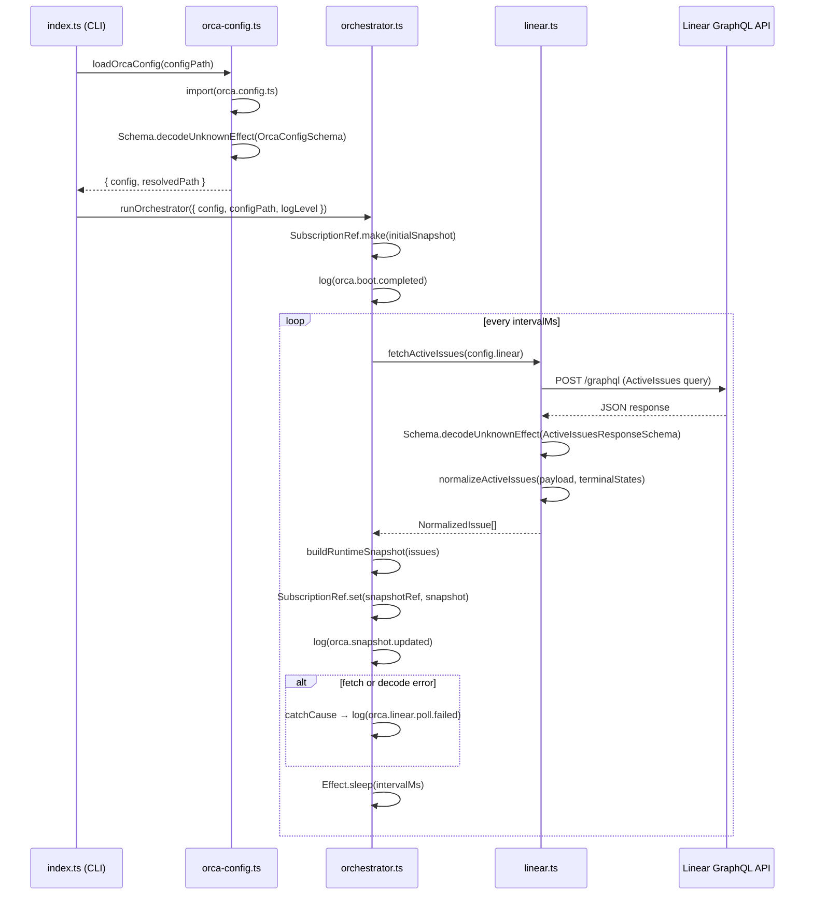

# Pull request review

Identifier: PET-46
Title: Orca bootstrap config and Linear discovery loop

## Original issue description

## What to build

Build the first end-to-end Orca tracer bullet: start from `orca.config.ts`, validate config with `Schema`, poll Linear for active issues, normalize linked PR refs, and maintain an in-memory orchestrator snapshot for a single runnable issue. Reference `SPEC-V2.md` sections 4, 5, 7, 8.1, 8.2, and 11.

## Acceptance criteria

- [ ] Starting Orca with a valid `orca.config.ts` boots successfully and invalid config fails fast with a schema-backed error.
- [ ] Orca polls Linear every 5 seconds, normalizes active issues including linked pull request refs, and selects at most one runnable issue at a time.
- [ ] A runtime snapshot and structured logs show the current normalized issue state, with tests covering config decode and Linear payload normalization.

## Existing pull request

- URL: https://github.com/peterje/orca2/pull/1
- Branch: orca/PET-46-orca-bootstrap-config-and-linear-discovery-loop-2

## Greptile review feedback

# Greptile review

Confidence: 4/5

## Unresolved review threads

<comment author="greptile-apps" path="apps/cli/src/orchestrator.ts">
  <diffHunk><![CDATA[
@@ -0,0 +1,99 @@
+import { Cause, Duration, Effect, SubscriptionRef } from "effect"
+import type { RuntimeSnapshot, SelectedRunnableIssue } from "./domain"
+import { formatErrorMessage } from "./error-format"
+import { fetchActiveIssues } from "./linear"
+import type { AppLogLevel } from "./logging"
+import { log } from "./logging"
+import type { OrcaConfig } from "./orca-config"
+
+const compareIssues = (
+  left: RuntimeSnapshot["activeIssues"][number],
+  right: RuntimeSnapshot["activeIssues"][number],
+) => {
+  const priorityDifference = left.priorityRank - right.priorityRank
+  if (priorityDifference !== 0) {
+    return priorityDifference
+  }
+
+  const createdAtDifference =
+    new Date(left.createdAt).getTime() - new Date(right.createdAt).getTime()
+  if (createdAtDifference !== 0) {
+    return createdAtDifference
+  }
+
+  return left.identifier.localeCompare(right.identifier)
+}
+
+export const selectRunnableIssue = (
+  issues: RuntimeSnapshot["activeIssues"],
+): SelectedRunnableIssue | null => {
+  const runnableIssues = issues
+    .filter((issue) => issue.runnable)
+    .sort(compareIssues)
+  const selectedIssue = runnableIssues[0]
+
+  if (!selectedIssue) {
+    return null
+  }
+
+  return {
+    id: selectedIssue.id,
+    identifier: selectedIssue.identifier,
+    title: selectedIssue.title,
+    normalizedState: "runnable",
+  }
+}
+
+export const buildRuntimeSnapshot = (
+  issues: RuntimeSnapshot["activeIssues"],
+): RuntimeSnapshot => ({
+  updatedAt: new Date().toISOString(),
+  activeIssues: [...issues].sort(compareIssues),
+  runnableIssue: selectRunnableIssue(issues),
+})
+
+const logSnapshot = (minimumLogLevel: AppLogLevel, snapshot: RuntimeSnapshot) =>
+  log(minimumLogLevel, "Info", "orca.snapshot.updated", {
+    active_issue_count: snapshot.activeIssues.length,
+    runnable_issue_identifier: snapshot.runnableIssue?.identifier ?? null,
+    snapshot,
+  })
+
+export const runOrchestrator = ({
+  config,
+  configPath,
+  logLevel,
+}: {
+  readonly config: OrcaConfig
+  readonly configPath: string
+  readonly logLevel: AppLogLevel
+}) =>
+  Effect.gen(function* () {
+    const snapshotRef = yield* SubscriptionRef.make<RuntimeSnapshot>({
+      updatedAt: new Date(0).toISOString(),
+      activeIssues: [],
+      runnableIssue: null,
+    })
  ]]></diffHunk>
  <lineNumber>76</lineNumber>
  <body>**`snapshotRef` is private and unexposed — `SubscriptionRef` adds no value here**

`snapshotRef` is created inside `runOrchestrator` and is never returned, yielded, or passed to any other effect. Because `runOrchestrator` is an infinite loop that never resolves, there is no way for external code to subscribe to or read the snapshot — making the pub/sub overhead of `SubscriptionRef` effectively unused. The ref is currently indistinguishable from a plain `Ref` at runtime.

If the intent is to expose the snapshot to future consumers (e.g., an HTTP status endpoint or an agent layer), `snapshotRef` needs to be part of the function's return type before the loop starts, or threaded through a service layer. Consider either:

1. Returning `snapshotRef` via a separate channel (e.g., `Deferred` or a service) before entering the polling loop.
2. Replacing with `Ref.make` until a subscriber actually exists, and leaving a `// TODO: switch to SubscriptionRef when X subscribes` comment to document the intent.

Without one of these changes, the reactive subscription capability of `SubscriptionRef` is silently dormant.
</body>
</comment>
<comment author="greptile-apps" path="apps/cli/src/orchestrator.ts">
  <diffHunk><![CDATA[
@@ -0,0 +1,99 @@
+import { Cause, Duration, Effect, SubscriptionRef } from "effect"
+import type { RuntimeSnapshot, SelectedRunnableIssue } from "./domain"
+import { formatErrorMessage } from "./error-format"
+import { fetchActiveIssues } from "./linear"
+import type { AppLogLevel } from "./logging"
+import { log } from "./logging"
+import type { OrcaConfig } from "./orca-config"
+
+const compareIssues = (
+  left: RuntimeSnapshot["activeIssues"][number],
+  right: RuntimeSnapshot["activeIssues"][number],
+) => {
+  const priorityDifference = left.priorityRank - right.priorityRank
+  if (priorityDifference !== 0) {
+    return priorityDifference
+  }
+
+  const createdAtDifference =
+    new Date(left.createdAt).getTime() - new Date(right.createdAt).getTime()
+  if (createdAtDifference !== 0) {
  ]]></diffHunk>
  <lineNumber>20</lineNumber>
  <body>**`new Date()` parse in sort comparator silently absorbs invalid dates**

`new Date(invalidString).getTime()` returns `NaN`, and `NaN - NaN === NaN`. JavaScript's `Array.sort` treats a comparator returning `NaN` as `0` (equal), so the `createdAt` tiebreaker is silently dropped and falls through to the `localeCompare` identifier comparison. In practice Linear returns valid ISO 8601 timestamps, so this is low risk — but a runtime invariant violation (e.g., a corrupted response body that passes schema validation because `createdAt: Schema.String` only checks the type, not the format) would produce subtly wrong sort order without any error.

Consider guarding with a non-`NaN` fallback:

```suggestion
  const leftTime = new Date(left.createdAt).getTime()
  const rightTime = new Date(right.createdAt).getTime()
  const createdAtDifference =
    Number.isFinite(leftTime) && Number.isFinite(rightTime)
      ? leftTime - rightTime
      : 0
```
</body>
</comment>

## General comments

<comments>
  <comment author="greptile-apps">
    <body><h3>Greptile Summary</h3>

This PR implements the first end-to-end Orca tracer bullet: it wires `orca.config.ts` schema validation, a Linear GraphQL polling loop, PR attachment normalization, and an in-memory `RuntimeSnapshot` orchestrator. All issues from the previous review round have been addressed — `Schema.decodeUnknownEffect` replaces the sync variant in both `orca-config.ts` and `linear.ts`, the `normalizedState` union now includes `"terminal"`, the `blockers: []` stub is annotated with a TODO, and the polling loop is hardened with `Effect.catchCause`.

**Key changes:**
- `orca-config.ts` — `decodeOrcaConfig` uses `Schema.decodeUnknownEffect`; `requiredEnvVar` annotates missing env var fields with human-readable error messages naming the expected variable.
- `linear.ts` — `decodeActiveIssuesResponse` returns a proper typed failure; `normalizeActiveIssues` correctly classifies issues into `runnable`, `linked-pr-detected`, and `terminal` states; GitHub PR URLs are extracted and deduplicated from Linear attachments.
- `orchestrator.ts` — `Effect.catchCause` replaces `Effect.catch` on the poll body, making the loop resilient to both typed failures and defects; a `SubscriptionRef` snapshot is built and logged each poll cycle.
- Three test files added covering config decode, Linear payload normalization, sort/selection logic, and error formatting.

**Minor observations:**
- `snapshotRef` (`SubscriptionRef`) is written to inside `runOrchestrator` but is local and never returned or exposed — no external code can subscribe to it in the current implementation. The reactive capability of `SubscriptionRef` is dormant until the function signature is updated to surface the ref.
- The verification steps (`bun run check`, `bun run build`) do not include `bun test`. Given the PR adds three test files that cover critical normalization and decode paths, explicitly running `bun test` before merge is recommended to confirm all assertions pass.

<h3>Confidence Score: 4/5</h3>

- Safe to merge with minor follow-up: the two style-level observations (unexposed SubscriptionRef and NaN-silent sort) do not affect correctness for the current tracer-bullet scope, and tests were not explicitly verified to pass.
- All critical issues from the previous review round have been resolved. The remaining observations are style-level or low-probability edge cases. The only noteworthy gap is that `bun test` is absent from the listed verification steps, leaving a small uncertainty about whether the new test assertions pass cleanly.
- apps/cli/src/orchestrator.ts — `snapshotRef` is never exposed; consider whether `SubscriptionRef` or plain `Ref` better communicates intent at this stage.

<h3>Important Files Changed</h3>


| Filename | Overview |
|----------|----------|
| apps/cli/src/orchestrator.ts | Polling loop now resilient via `Effect.catchCause`; `SubscriptionRef` created but never exposed or subscribed to — acts as plain `Ref` in the current codebase. |
| apps/cli/src/linear.ts | Correctly uses `Schema.decodeUnknownEffect` (not the sync variant), adds a "terminal" normalizedState variant, and documents the `blockers: []` stub with a TODO comment. No new issues found. |
| apps/cli/src/orca-config.ts | Config validation now uses `Schema.decodeUnknownEffect`; `requiredEnvVar` annotates missing env var fields with named messages. Implementation looks correct. |
| apps/cli/src/domain.ts | Clean domain schema definitions for `NormalizedIssue`, `LinkedPullRequestRef`, `BlockerRef`, `SelectedRunnableIssue`, and `RuntimeSnapshot`; all three `normalizedState` variants are present. |
| apps/cli/src/index.ts | CLI entry point wires config loading, orchestrator, and error formatting correctly. `Effect.catch` handles all typed failures from config load and orchestration. |
| orca.config.ts | Root config file reads secrets from env vars; safe to commit. All required fields match the `OrcaConfigSchema` shape. |

</details>


<h3>Sequence Diagram</h3>



<!-- greptile_other_comments_section -->

<sub>Last reviewed commit: 2ea59ee</sub></body>
  </comment>
</comments>

## Repo instructions

# Information
- The base branch for this repository is `main`.
- The package manager used is `bun`.
- The runtime used is Bun

# Learning more about the "effect" & "@effect/\*" packages
`~/.reference/effect-v4` is an authoritative source of information about the
"effect" and "@effect/\*" packages. Read this before looking elsewhere for
information about these packages. It contains the best practices for using
effect. Use this for learning more about the library, rather than browsing the code in
`node_modules/`. Effect provides many utilities and composition patterns: Services and Layers, data strctures, Schema, and even CLI builders. Always search for and leverage Effect-native solutions where possible. Never rewrite your own code that can be modeled with Effect, eg parsing / validation / concurrency.

## Code Style
- use kebab-case for all file names.

# Testing
Test everything with `bun test`

# Git Workflow
- test and typecheck before committing.
- commit directly to main
- always use conventional commits.
- prefer lowercase.
   - "cli", not "CLI"
   - "github", not "GitHub"
   - "http", not "HTTP"
- write commits and descriptions in imperative mood
- all pr commits will be squashed: ensure pr titles follow the same rules as commits
</git>


## Orca execution constraints

- Work only in the current worktree on branch `orca/PET-46-orca-bootstrap-config-and-linear-discovery-loop-2`.
- Base branch is `main`.
- Address the requested Greptile feedback and keep the existing pull request moving.
- Do not ask for permission; pick reasonable defaults and keep going.
- Do not mutate unrelated git state.
- Do not commit secrets or any files under `.orca/`.
- Use a conventional commit message if you create a commit.
- Keep using the existing branch and pull request.

## Verification commands

- `bun run check`
- `bun run build`

## Required git outcome

- Have the existing branch ready for another Greptile review pass.
- Use a conventional commit message every time you create a commit.
- Update the existing pull request instead of creating a new branch or pull request.
- Keep the pull request title unchanged.
- If you update the PR description, keep the same lowercase narrative format with `**closes**`, `**summary**`, and `**verification**`.
- Mention the verification commands you ran in any pull request update you make.
