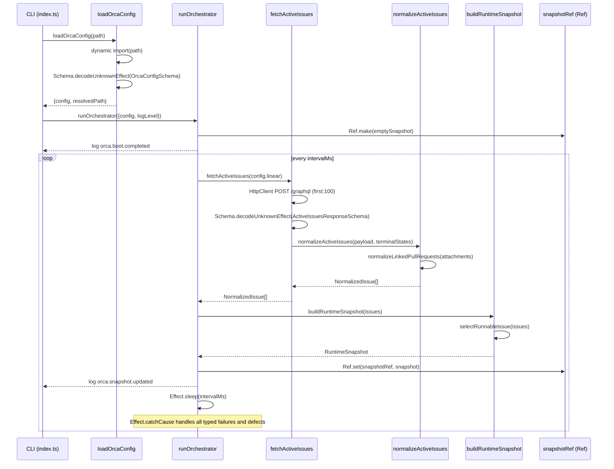

# Pull request review

Identifier: PET-46
Title: Orca bootstrap config and Linear discovery loop

## Original issue description

## What to build

Build the first end-to-end Orca tracer bullet: start from `orca.config.ts`, validate config with `Schema`, poll Linear for active issues, normalize linked PR refs, and maintain an in-memory orchestrator snapshot for a single runnable issue. Reference `SPEC-V2.md` sections 4, 5, 7, 8.1, 8.2, and 11.

## Acceptance criteria

- [ ] Starting Orca with a valid `orca.config.ts` boots successfully and invalid config fails fast with a schema-backed error.
- [ ] Orca polls Linear every 5 seconds, normalizes active issues including linked pull request refs, and selects at most one runnable issue at a time.
- [ ] A runtime snapshot and structured logs show the current normalized issue state, with tests covering config decode and Linear payload normalization.

## Existing pull request

- URL: https://github.com/peterje/orca2/pull/1
- Branch: orca/PET-46-orca-bootstrap-config-and-linear-discovery-loop-2

## Greptile review feedback

# Greptile review

Confidence: 4/5

## General comments

<comments>
  <comment author="greptile-apps">
    <body><h3>Greptile Summary</h3>

This PR implements the first end-to-end Orca tracer bullet: Effect Schema-validated config loading, a Linear GraphQL polling loop, PR attachment normalization, and an in-memory `RuntimeSnapshot` managed by a resilient orchestrator. All defects flagged in the previous review round have been resolved — typed schema decoding (`decodeUnknownEffect`), defect-safe polling (`Effect.catchCause`), correct `Ref` usage, `NaN`-safe date comparisons, proper spread ordering in the logger, non-nullable `attachmentId`, the `"terminal"` state literal, and the `"cancelled"` type check.

Three new observations from this pass:

- **`attachmentId` / `title` mismatch after deduplication upgrade** (`apps/cli/src/linear.ts:141`): when the title is promoted from a later non-null attachment, `attachmentId` is left pointing at the first (null-title) attachment, so the two fields in `LinkedPullRequestRef` reference different Linear attachment records.
- **No pagination on the GraphQL query** (`apps/cli/src/linear.ts:75`): `first: 100` silently truncates results with no `hasNextPage` guard; low risk for a small project but worth noting.
- **Startup errors bypass the structured logger** (`apps/cli/src/index.ts:39`): config load failures and top-level schema errors are written as plain text via `console.error`, inconsistent with the NDJSON format used by all runtime log calls.
- **Stale `"grepline"` name in root `package.json`** (`package.json:2`): binary was renamed to `orca` but the workspace root name and `dev` script filter still reference `@grepline/cli`.

<h3>Confidence Score: 4/5</h3>

- Safe to merge — all previously flagged defects are resolved; remaining items are minor logic and style concerns with no critical runtime impact.
- All critical issues from the prior review (sync schema decode producing defects, unresisted poll-loop termination, missing `"cancelled"` terminal check, nullable `attachmentId`, incorrect log spread order) are cleanly addressed with matching test coverage. The new `attachmentId`/`title` mismatch after deduplication is a real inconsistency but not a runtime failure under current usage. Pagination truncation and log format inconsistency are low-severity style concerns. One point deducted for the `attachmentId` mismatch which could surprise downstream consumers.
- `apps/cli/src/linear.ts` (attachmentId mismatch, pagination cap) and `package.json` (stale grepline name) warrant a second look.

<h3>Important Files Changed</h3>

| Filename | Overview |
|----------|----------|
| apps/cli/src/linear.ts | Core Linear integration: schema decoding, PR normalization, and GraphQL fetch. `decodeUnknownEffect` correctly used; terminal/cancelled states handled; deduplication upgraded to prefer non-null titles — but `attachmentId` is not updated alongside `title` during the upgrade, creating a mismatch. Query is also silently capped at 100 results with no pagination guard. |
| apps/cli/src/orchestrator.ts | Polling orchestrator with `Effect.catchCause` for defect resilience, `Ref` (not `SubscriptionRef`), `Number.isFinite` guard on date comparator, and clean infinite loop. All previously flagged issues resolved. |
| apps/cli/src/orca-config.ts | Config loading with `Schema.decodeUnknownEffect` and `requiredEnvVar` helpers for descriptive env-var error messages. The `message` annotation is passed as a plain string rather than a `(issue: ParseIssue) => string` function (previously flagged); whether this works at runtime depends on the Effect Schema v4 internals. |
| apps/cli/src/index.ts | CLI entry point wiring config loading, orchestrator, and top-level error handling. Startup errors are emitted as plain `console.error` text while all runtime errors use the structured JSON logger, creating a mixed-format log stream. |
| apps/cli/src/domain.ts | Domain schemas for `NormalizedIssue`, `LinkedPullRequestRef`, and `RuntimeSnapshot`. All three `NormalizedState` literals present; `attachmentId` correctly typed as non-nullable `Schema.String`; `blockers` stub documented with TODO. |
| apps/cli/src/logging.ts | Structured JSON logger with severity filtering. Reserved keys (`timestamp`, `level`, `event`) are correctly placed after `...fields` spread so they always win on collision. |
| package.json | Workspace root still named `"grepline"` with a `dev` filter referencing `@grepline/cli`, while the CLI binary was renamed to `orca` — a partial rename that leaves inconsistent identifiers across the monorepo root. |
| orca.config.ts | Development config template reading env vars for Linear and GitHub. `requiredScore` updated from `5` to `4`, resolving the self-gate concern from the previous review round. |

<h3>Sequence Diagram</h3>

<!-- greptile_other_comments_section -->

Last reviewed commit: 0bd64c9</body>
  </comment>
</comments>

## Repo instructions

# Information
- The base branch for this repository is `main`.
- The package manager used is `bun`.
- The runtime used is Bun

# Learning more about the "effect" & "@effect/\*" packages
`~/.reference/effect-v4` is an authoritative source of information about the
"effect" and "@effect/\*" packages. Read this before looking elsewhere for
information about these packages. It contains the best practices for using
effect. Use this for learning more about the library, rather than browsing the code in
`node_modules/`. Effect provides many utilities and composition patterns: Services and Layers, data strctures, Schema, and even CLI builders. Always search for and leverage Effect-native solutions where possible. Never rewrite your own code that can be modeled with Effect, eg parsing / validation / concurrency.

## Code Style
- use kebab-case for all file names.

# Testing
Test everything with `bun test`

# Git Workflow
- test and typecheck before committing.
- commit directly to main
- always use conventional commits.
- prefer lowercase.
   - "cli", not "CLI"
   - "github", not "GitHub"
   - "http", not "HTTP"
- write commits and descriptions in imperative mood
- all pr commits will be squashed: ensure pr titles follow the same rules as commits
</git>

## Orca execution constraints

- Work only in the current worktree on branch `orca/PET-46-orca-bootstrap-config-and-linear-discovery-loop-2`.
- Base branch is `main`.
- Address the requested Greptile feedback and keep the existing pull request moving.
- Do not ask for permission; pick reasonable defaults and keep going.
- Do not mutate unrelated git state.
- Do not commit secrets or any files under `.orca/`.
- Use a conventional commit message if you create a commit.
- Keep using the existing branch and pull request.

## Verification commands

- `bun run check`
- `bun run build`

## Required git outcome

- Have the existing branch ready for another Greptile review pass.
- Use a conventional commit message every time you create a commit.
- Update the existing pull request instead of creating a new branch or pull request.
- Keep the pull request title unchanged.
- If you update the PR description, keep the same lowercase narrative format with `**closes**`, `**summary**`, and `**verification**`.
- Mention the verification commands you ran in any pull request update you make.
