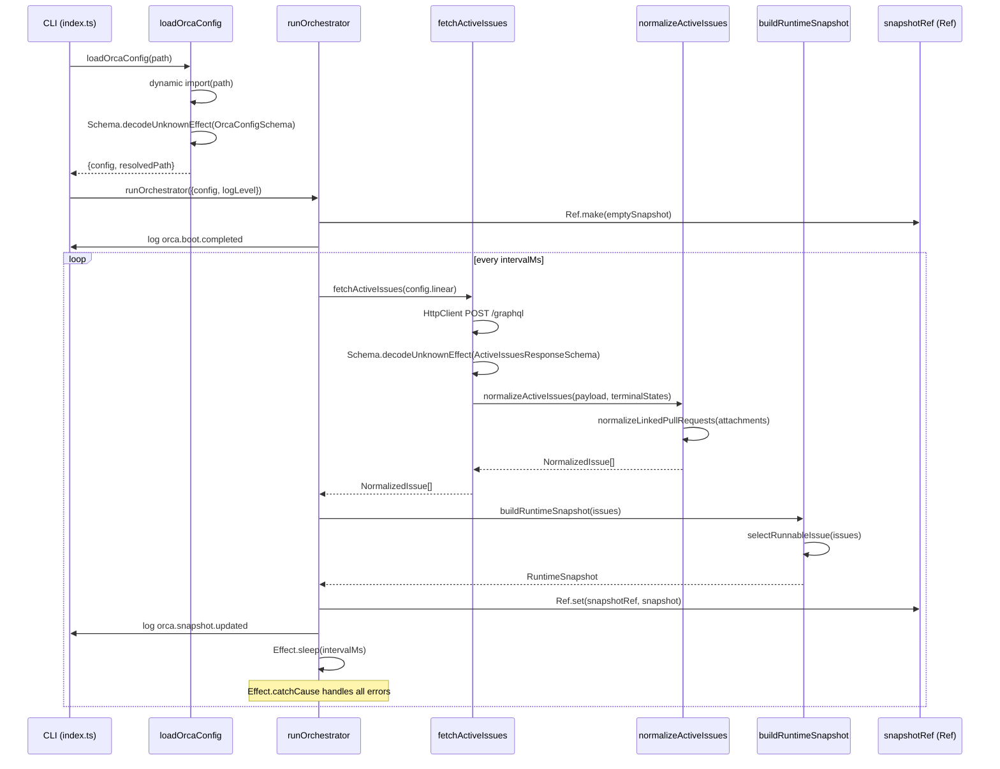

# Pull request review

Identifier: PET-46
Title: Orca bootstrap config and Linear discovery loop

## Original issue description

## What to build

Build the first end-to-end Orca tracer bullet: start from `orca.config.ts`, validate config with `Schema`, poll Linear for active issues, normalize linked PR refs, and maintain an in-memory orchestrator snapshot for a single runnable issue. Reference `SPEC-V2.md` sections 4, 5, 7, 8.1, 8.2, and 11.

## Acceptance criteria

- [ ] Starting Orca with a valid `orca.config.ts` boots successfully and invalid config fails fast with a schema-backed error.
- [ ] Orca polls Linear every 5 seconds, normalizes active issues including linked pull request refs, and selects at most one runnable issue at a time.
- [ ] A runtime snapshot and structured logs show the current normalized issue state, with tests covering config decode and Linear payload normalization.

## Existing pull request

- URL: https://github.com/peterje/orca2/pull/1
- Branch: orca/PET-46-orca-bootstrap-config-and-linear-discovery-loop-2

## Greptile review feedback

# Greptile review

Confidence: 4/5

## Unresolved review threads

<comment author="greptile-apps" path="apps/cli/src/linear.ts">
  <diffHunk><![CDATA[
@@ -0,0 +1,249 @@
+import { Data, Effect, Schema } from "effect"
+import {
+  HttpBody,
+  HttpClient,
+  HttpClientRequest,
+  HttpClientResponse,
+} from "effect/unstable/http"
+import type { LinkedPullRequestRef, NormalizedIssue } from "./domain"
+
+const LabelSchema = Schema.Struct({
+  id: Schema.String,
+  name: Schema.String,
+})
+
+const AttachmentSchema = Schema.Struct({
+  id: Schema.String,
+  title: Schema.NullOr(Schema.String),
+  subtitle: Schema.NullOr(Schema.String),
+  url: Schema.String,
+  metadata: Schema.Unknown,
+  sourceType: Schema.NullOr(Schema.String),
+})
+
+const RawIssueSchema = Schema.Struct({
+  id: Schema.String,
+  identifier: Schema.String,
+  title: Schema.String,
+  description: Schema.NullOr(Schema.String),
+  branchName: Schema.NullOr(Schema.String),
+  priority: Schema.Number,
+  createdAt: Schema.String,
+  updatedAt: Schema.String,
+  state: Schema.Struct({
+    id: Schema.String,
+    name: Schema.String,
+    type: Schema.NullOr(Schema.String),
+  }),
+  labels: Schema.Struct({
+    nodes: Schema.Array(LabelSchema),
+  }),
+  attachments: Schema.Struct({
+    nodes: Schema.Array(AttachmentSchema),
+  }),
+})
+
+type RawIssue = Schema.Schema.Type<typeof RawIssueSchema>
+type RawAttachment = RawIssue["attachments"]["nodes"][number]
+
+const LinearGraphqlErrorSchema = Schema.Struct({
+  message: Schema.String,
+})
+
+export const ActiveIssuesResponseSchema = Schema.Struct({
+  data: Schema.NullOr(
+    Schema.Struct({
+      issues: Schema.Struct({
+        nodes: Schema.Array(RawIssueSchema),
+      }),
+    }),
+  ),
+  errors: Schema.optional(Schema.Array(LinearGraphqlErrorSchema)),
+})
+
+export type ActiveIssuesResponse = Schema.Schema.Type<
+  typeof ActiveIssuesResponseSchema
+>
+
+export class LinearApiError extends Data.TaggedError("LinearApiError")<{
+  readonly message: string
+}> {}
+
+export const decodeActiveIssuesResponse = (input: unknown) =>
+  Schema.decodeUnknownEffect(ActiveIssuesResponseSchema)(input)
+
+const activeIssuesQuery = `
+  query ActiveIssues($projectSlug: String!, $activeStates: [String!]!) {
+    issues(
+      first: 100
+      filter: {
+        project: { slug: { eq: $projectSlug } }
+        state: { name: { in: $activeStates } }
+      }
+    ) {
+      nodes {
+        id
+        identifier
+        title
+        description
+        branchName
+        priority
+        createdAt
+        updatedAt
+        state {
+          id
+          name
+          type
+        }
+        labels {
+          nodes {
+            id
+            name
+          }
+        }
+        attachments {
+          nodes {
+            id
+            title
+            subtitle
+            url
+            metadata
+            sourceType
+          }
+        }
+      }
+    }
+  }
+`
+
+const pullRequestUrlPattern =
+  /^https:\/\/github\.com\/([^/]+)\/([^/]+)\/pull\/(\d+)(?:[/?#].*)?$/i
+
+const normalizeLinkedPullRequests = (
+  attachments: ReadonlyArray<RawAttachment>,
+): Array<LinkedPullRequestRef> => {
+  const deduped = new Map<string, LinkedPullRequestRef>()
+
+  for (const attachment of attachments) {
+    const match = attachment.url.match(pullRequestUrlPattern)
+    if (!match) {
+      continue
+    }
+
+    const [, owner, repo, numberText] = match
+    if (!owner || !repo || !numberText) {
+      continue
+    }
+
+    const number = Number(numberText)
+    const key = `${owner}/${repo}#${number}`
+
+    if (deduped.has(key)) {
+      continue
+    }
+
+    deduped.set(key, {
+      provider: "github",
+      owner,
+      repo,
+      number,
+      url: attachment.url,
+      title: attachment.title,
+      attachmentId: attachment.id,
+    })
+  }
  ]]></diffHunk>
  <lineNumber>154</lineNumber>
  <body>**First-seen attachment wins, even when its title is `null`**

`deduped.has(key)` causes the loop to skip every subsequent attachment for the same PR. If the first attachment has `title: null` but a later attachment for the same PR has a descriptive title (e.g. `"fix: auth token refresh"`), the null title silently wins and the result's `title` field is `null`.

Since `attachment.title` is `NullOr(Schema.String)`, it's worth preferring a non-null title over a null one when deduplicating:

```ts
if (deduped.has(key)) {
  // Prefer a non-null title if the already-stored entry has null
  const existing = deduped.get(key)!
  if (existing.title === null && attachment.title !== null) {
    deduped.set(key, { ...existing, title: attachment.title })
  }
  continue
}
```

In practice, Linear typically sets the same title on both attachments for the same PR, so this is low-risk — but the silent data-loss path is worth closing.</body>
</comment>
<comment author="greptile-apps" path="orca.config.ts">
  <diffHunk><![CDATA[
@@ -0,0 +1,43 @@
+export default {
+  linear: {
+    apiKey: process.env.LINEAR_API_KEY,
+    endpoint: "https://api.linear.app/graphql",
+    projectSlug: "orca",
+    activeStates: ["Todo", "In Progress"],
+    terminalStates: ["Done", "Closed", "Cancelled", "Canceled", "Duplicate"],
+  },
+  github: {
+    token: process.env.GITHUB_TOKEN,
+    apiUrl: "https://api.github.com",
+    owner: "peterje",
+    repo: "orca2",
+    baseBranch: "main",
+  },
+  polling: {
+    intervalMs: 5_000,
+  },
+  worktree: {
+    repoRoot: ".",
+    root: ".orca/worktrees",
+  },
+  agent: {
+    maxTurns: 12,
+    maxRetryBackoffMs: 300_000,
+  },
+  codex: {
+    executable: "codex",
+    args: ["app-server"],
+    turnTimeoutMs: 3_600_000,
+    readTimeoutMs: 5_000,
+    stallTimeoutMs: 300_000,
+  },
+  greptile: {
+    enabled: true,
+    summonComment: "@greptileai",
+    requiredScore: 5,
  ]]></diffHunk>
  <lineNumber>37</lineNumber>
  <body>**`requiredScore: 5` will gate Orca's own PRs**

The Greptile section is configured with `requiredScore: 5` (perfect confidence). Greptile's review of this very PR returned 4/5. If downstream Orca logic uses this threshold to block PR merges, Orca's own bootstrap PR would be blocked by itself.

Consider whether `4` is a more practical minimum for initial operation, or whether the gate should be applied only to agent-authored PRs (not the bootstrap config PR itself).</body>
</comment>

## General comments

<comments>
  <comment author="greptile-apps">
    <body><h3>Greptile Summary</h3>

This PR implements the first end-to-end Orca tracer bullet: config validation via Effect Schema, a Linear polling loop, PR attachment normalization, and an in-memory runtime snapshot — wiring together the CLI entry point, orchestrator, and structured logger.

All previously flagged review issues have been resolved:
- `Schema.decodeUnknownEffect` (non-sync) is now used in both `orca-config.ts` and `linear.ts`, keeping schema errors in the typed failure channel
- `Effect.catchCause` in the poll loop catches both typed failures and defects, making the daemon resilient
- `NormalizedStateSchema` includes the `"terminal"` literal; `normalizeActiveIssues` correctly assigns it
- `state.type === "cancelled"` is checked alongside `"completed"` in the terminal guard
- `attachmentId` is `Schema.String` (non-nullable), matching the runtime guarantee
- `Ref.make` replaces the unnecessary `SubscriptionRef`; the `snapshotRef` is a clear placeholder for a future status endpoint
- `...fields` spread precedes reserved keys in `log`, so `timestamp`/`level`/`event` always win on collision
- `Number.isFinite` guard prevents silent NaN comparisons in the sort tiebreaker
- `requiredEnvVar` provides descriptive per-field error messages via `.annotate({ message })`
- `blockers: []` is annotated with a `TODO` comment

Two minor new observations:
- `normalizeLinkedPullRequests` uses first-seen deduplication, which silently prefers a `null` title over a descriptive one if the first attachment happens to have `title: null`
- `greptile.requiredScore: 5` in `orca.config.ts` sets a perfect-score gate that would block Orca's own PRs (including this one at 4/5)

<h3>Confidence Score: 4/5</h3>

- Safe to merge — all previously flagged defects are resolved; remaining items are minor style/config concerns with no runtime impact.
- All critical issues from the prior review round (sync schema decode, defect-bypassing poll loop, missing cancelled terminal check, nullable attachmentId, incorrect spread order) are cleanly addressed. The two new observations are low-severity: the null-title deduplication edge case is unlikely to trigger given Linear's typical behavior, and the requiredScore config value is a policy question rather than a correctness bug. Test coverage is thorough across normalization, config decode, sorting, and error formatting.
- apps/cli/src/linear.ts (deduplication null-title edge case), orca.config.ts (requiredScore: 5 self-gate concern)

<h3>Important Files Changed</h3>


| Filename | Overview |
|----------|----------|
| apps/cli/src/linear.ts | Core linear integration: schema decoding, PR normalization, and API fetch. Previous issues (sync decode, missing cancelled state, normalizedState semantics) all resolved; minor first-wins deduplication can silently prefer a null title over a descriptive one. |
| apps/cli/src/orchestrator.ts | Polling orchestrator with resilient catchCause, correct Ref usage, and NaN-safe date comparator. All previously flagged issues (SubscriptionRef, NaN sort, defect bypass) addressed. |
| apps/cli/src/orca-config.ts | Config loading with Schema.decodeUnknownEffect and requiredEnvVar annotations. Sync decode issue resolved; annotation message format (string vs function) was previously flagged. |
| apps/cli/src/domain.ts | Domain schemas for NormalizedIssue, LinkedPullRequestRef, RuntimeSnapshot. attachmentId correctly typed as non-nullable; terminal state literal added to NormalizedStateSchema. |
| apps/cli/src/logging.ts | Structured JSON logger with severity filtering. Reserved keys (timestamp, level, event) correctly placed after ...fields spread so they always win on collision. |
| apps/cli/src/index.ts | CLI entry point wiring config loading, orchestrator, and top-level error handling. Clean Effect pipeline with proper layer provision. |
| orca.config.ts | Development config template reading env vars. greptile.requiredScore: 5 is strict — Greptile's current confidence of 4/5 on this PR would technically fail Orca's own gate. |

</details>


<h3>Sequence Diagram</h3>



<!-- greptile_other_comments_section -->

<sub>Last reviewed commit: 99e2e51</sub></body>
  </comment>
</comments>

## Repo instructions

# Information
- The base branch for this repository is `main`.
- The package manager used is `bun`.
- The runtime used is Bun

# Learning more about the "effect" & "@effect/\*" packages
`~/.reference/effect-v4` is an authoritative source of information about the
"effect" and "@effect/\*" packages. Read this before looking elsewhere for
information about these packages. It contains the best practices for using
effect. Use this for learning more about the library, rather than browsing the code in
`node_modules/`. Effect provides many utilities and composition patterns: Services and Layers, data strctures, Schema, and even CLI builders. Always search for and leverage Effect-native solutions where possible. Never rewrite your own code that can be modeled with Effect, eg parsing / validation / concurrency.

## Code Style
- use kebab-case for all file names.

# Testing
Test everything with `bun test`

# Git Workflow
- test and typecheck before committing.
- commit directly to main
- always use conventional commits.
- prefer lowercase.
   - "cli", not "CLI"
   - "github", not "GitHub"
   - "http", not "HTTP"
- write commits and descriptions in imperative mood
- all pr commits will be squashed: ensure pr titles follow the same rules as commits
</git>


## Orca execution constraints

- Work only in the current worktree on branch `orca/PET-46-orca-bootstrap-config-and-linear-discovery-loop-2`.
- Base branch is `main`.
- Address the requested Greptile feedback and keep the existing pull request moving.
- Do not ask for permission; pick reasonable defaults and keep going.
- Do not mutate unrelated git state.
- Do not commit secrets or any files under `.orca/`.
- Use a conventional commit message if you create a commit.
- Keep using the existing branch and pull request.

## Verification commands

- `bun run check`
- `bun run build`

## Required git outcome

- Have the existing branch ready for another Greptile review pass.
- Use a conventional commit message every time you create a commit.
- Update the existing pull request instead of creating a new branch or pull request.
- Keep the pull request title unchanged.
- If you update the PR description, keep the same lowercase narrative format with `**closes**`, `**summary**`, and `**verification**`.
- Mention the verification commands you ran in any pull request update you make.
