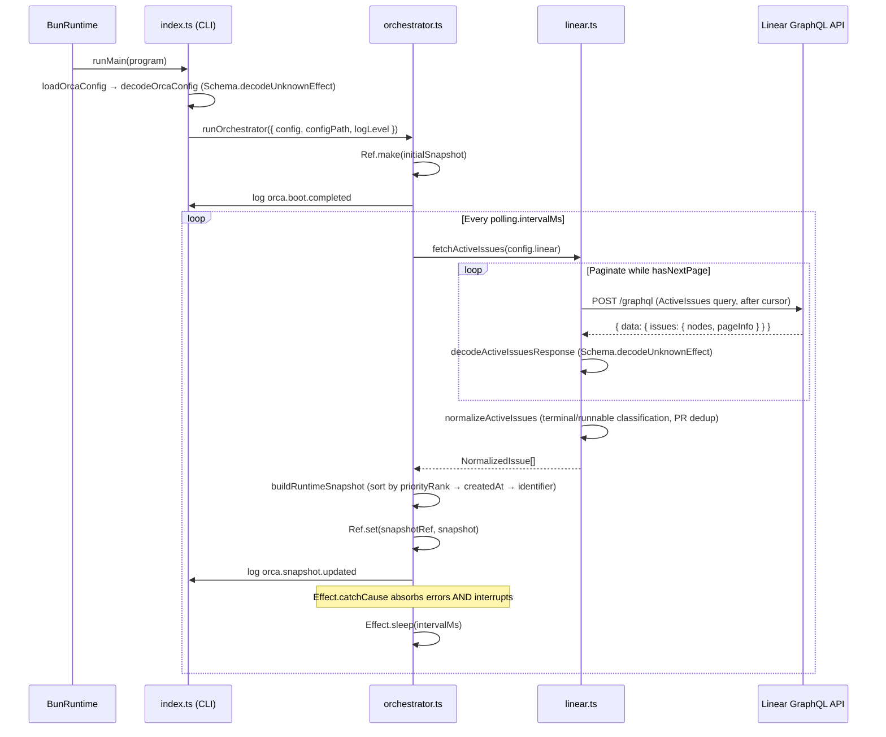

# Pull request review

Identifier: PET-46
Title: Orca bootstrap config and Linear discovery loop

## Original issue description

## What to build

Build the first end-to-end Orca tracer bullet: start from `orca.config.ts`, validate config with `Schema`, poll Linear for active issues, normalize linked PR refs, and maintain an in-memory orchestrator snapshot for a single runnable issue. Reference `SPEC-V2.md` sections 4, 5, 7, 8.1, 8.2, and 11.

## Acceptance criteria

- [ ] Starting Orca with a valid `orca.config.ts` boots successfully and invalid config fails fast with a schema-backed error.
- [ ] Orca polls Linear every 5 seconds, normalizes active issues including linked pull request refs, and selects at most one runnable issue at a time.
- [ ] A runtime snapshot and structured logs show the current normalized issue state, with tests covering config decode and Linear payload normalization.

## Existing pull request

- URL: https://github.com/peterje/orca2/pull/1
- Branch: orca/PET-46-orca-bootstrap-config-and-linear-discovery-loop-2

## Greptile review feedback

# Greptile review

Confidence: 3/5

## Unresolved review threads

<comment author="greptile-apps" path="apps/cli/src/orchestrator.ts">
  <diffHunk><![CDATA[
@@ -0,0 +1,103 @@
+import { Cause, Duration, Effect, Ref } from "effect"
+import type { RuntimeSnapshot, SelectedRunnableIssue } from "./domain"
+import { formatErrorMessage } from "./error-format"
+import { fetchActiveIssues } from "./linear"
+import type { AppLogLevel } from "./logging"
+import { log } from "./logging"
+import type { OrcaConfig } from "./orca-config"
+
+const compareIssues = (
+  left: RuntimeSnapshot["activeIssues"][number],
+  right: RuntimeSnapshot["activeIssues"][number],
+) => {
+  const priorityDifference = left.priorityRank - right.priorityRank
+  if (priorityDifference !== 0) {
+    return priorityDifference
+  }
+
+  const leftCreatedAtTime = new Date(left.createdAt).getTime()
+  const rightCreatedAtTime = new Date(right.createdAt).getTime()
+  const createdAtDifference =
+    Number.isFinite(leftCreatedAtTime) && Number.isFinite(rightCreatedAtTime)
+      ? leftCreatedAtTime - rightCreatedAtTime
+      : 0
+  if (createdAtDifference !== 0) {
+    return createdAtDifference
+  }
+
+  return left.identifier.localeCompare(right.identifier)
+}
+
+export const selectRunnableIssue = (
+  issues: RuntimeSnapshot["activeIssues"],
+): SelectedRunnableIssue | null => {
+  const runnableIssues = issues
+    .filter((issue) => issue.runnable)
+    .sort(compareIssues)
+  const selectedIssue = runnableIssues[0]
+
+  if (!selectedIssue) {
+    return null
+  }
+
+  return {
+    id: selectedIssue.id,
+    identifier: selectedIssue.identifier,
+    title: selectedIssue.title,
+    normalizedState: "runnable",
+  }
+}
+
+export const buildRuntimeSnapshot = (
+  issues: RuntimeSnapshot["activeIssues"],
+): RuntimeSnapshot => ({
+  updatedAt: new Date().toISOString(),
+  activeIssues: [...issues].sort(compareIssues),
+  runnableIssue: selectRunnableIssue(issues),
+})
+
+const logSnapshot = (minimumLogLevel: AppLogLevel, snapshot: RuntimeSnapshot) =>
+  log(minimumLogLevel, "Info", "orca.snapshot.updated", {
+    active_issue_count: snapshot.activeIssues.length,
+    runnable_issue_identifier: snapshot.runnableIssue?.identifier ?? null,
+    snapshot,
+  })
+
+export const runOrchestrator = ({
+  config,
+  configPath,
+  logLevel,
+}: {
+  readonly config: OrcaConfig
+  readonly configPath: string
+  readonly logLevel: AppLogLevel
+}) =>
+  Effect.gen(function* () {
+    const snapshotRef = yield* Ref.make<RuntimeSnapshot>({
+      updatedAt: new Date(0).toISOString(),
+      activeIssues: [],
+      runnableIssue: null,
+    })
+
+    yield* log(logLevel, "Info", "orca.boot.completed", {
+      config_path: configPath,
+      polling_interval_ms: config.polling.intervalMs,
+      linear_project_slug: config.linear.projectSlug,
+    })
+
+    const pollOnce = fetchActiveIssues(config.linear).pipe(
+      Effect.map(buildRuntimeSnapshot),
+      Effect.tap((snapshot) => Ref.set(snapshotRef, snapshot)),
+      Effect.tap((snapshot) => logSnapshot(logLevel, snapshot)),
+      Effect.catchCause((cause: Cause.Cause<unknown>) =>
+        log(logLevel, "Error", "orca.linear.poll.failed", {
+          message: formatErrorMessage(Cause.squash(cause)),
+        }),
+      ),
  ]]></diffHunk>
  <lineNumber>96</lineNumber>
  <body>**`Effect.catchCause` swallows interrupt causes, preventing graceful shutdown**

`Effect.catchCause` catches ALL causes — typed failures, defects, _and_ fiber interrupts. `BunRuntime.runMain` (used in `bin.ts`) handles SIGTERM by interrupting the root fiber. That interrupt propagates into `pollOnce`, where this handler catches it, logs it as `orca.linear.poll.failed`, and returns `void`. The while-loop then continues with the next `Effect.sleep`, meaning SIGTERM never terminates the daemon. The process only dies via SIGKILL.

Re-raise interrupt causes so `BunRuntime.runMain` can perform a clean shutdown:

```ts
Effect.catchCause((cause: Cause.Cause<unknown>) =>
  Cause.isInterrupted(cause)
    ? Effect.failCause(cause)
    : log(logLevel, "Error", "orca.linear.poll.failed", {
        message: formatErrorMessage(Cause.squash(cause)),
      }),
),
```
</body>
</comment>

## General comments

<comments>
  <comment author="greptile-apps">
    <body><h3>Greptile Summary</h3>

This PR delivers the first end-to-end Orca tracer bullet: Effect Schema-validated config loading, a paginated Linear GraphQL polling loop, PR attachment normalization with deduplication, and an in-memory `RuntimeSnapshot` managed by an orchestrator. All issues flagged in the previous review round have been resolved — `Schema.decodeUnknownEffect` for typed decoding, `Effect.catchCause` for defect-resilient polling, `Ref` replacing `SubscriptionRef`, `Number.isFinite` guarding date comparisons, correct spread ordering in the logger, non-nullable `attachmentId`, the `"terminal"` state literal, the `"cancelled"` type check, full pagination with `pageInfo`, and `requiredScore` updated to `4`.

One new issue remains:

- **Interrupt swallowing in `orchestrator.ts`**: `Effect.catchCause` catches all causes — including fiber interrupts. `BunRuntime.runMain` (in `bin.ts`) handles SIGTERM by interrupting the root fiber, but that interrupt will be absorbed by this handler (logged as a poll failure) and the while-loop will continue. The daemon becomes unkillable short of `SIGKILL`. The fix is to re-raise interrupted causes before logging.

<h3>Confidence Score: 3/5</h3>

- Core polling and normalization logic is solid, but the interrupt-swallowing bug in the orchestrator means the daemon cannot be gracefully shut down via SIGTERM.
- All previously flagged issues are addressed and test coverage is thorough. The single new issue (Effect.catchCause swallowing interrupt causes) is a real behavioral defect that affects production operability — SIGTERM will not cleanly stop the daemon when deployed — which warrants holding the score at 3 until fixed.
- apps/cli/src/orchestrator.ts — the Effect.catchCause handler needs to re-raise interrupted causes.

<h3>Important Files Changed</h3>


| Filename | Overview |
|----------|----------|
| apps/cli/src/orchestrator.ts | Polling loop correctly uses Ref and catchCause for defect resilience, but the catchCause handler swallows interrupt causes — SIGTERM from BunRuntime.runMain will be absorbed and the daemon will continue running indefinitely. |
| apps/cli/src/linear.ts | Full pagination with pageInfo, typed decoding via Schema.decodeUnknownEffect, correct deduplication preferring non-null titles (and updating attachmentId consistently), terminal state handling for both "completed" and "cancelled" types, and a TODO stub for blockers — no new issues found. |
| apps/cli/src/orca-config.ts | Config loading uses Schema.decodeUnknownEffect correctly; requiredEnvVar helper annotates missing env vars with descriptive names. The message annotation is passed as a plain string (previously flagged); test coverage exercises the LINEAR_API_KEY error path. |
| apps/cli/src/domain.ts | Schemas updated with terminal NormalizedState literal, non-nullable attachmentId (Schema.String), and correct SelectedRunnableIssue/RuntimeSnapshot shapes — all previously flagged issues addressed. |
| apps/cli/src/index.ts | Startup errors now routed through writeLogLine for structured JSON output; Effect.catch correctly wraps the full command pipeline for typed failure handling. |
| apps/cli/src/logging.ts | Reserved keys (timestamp, level, event) are now spread last in formatLogLine, correctly overriding any caller-supplied collisions; test coverage verifies this behaviour. |
| apps/cli/src/linear.test.ts | Comprehensive normalization tests covering deduplication, terminal/cancelled state handling, priority+age sort, NaN-safe date fallback, and pagination — notably the dedupe test now correctly asserts attachmentId: "attachment-11" alongside the non-null title. |
| orca.config.ts | requiredScore updated from 5 to 4; all field values look correct. Env var placeholders will produce descriptive schema errors via requiredEnvVar. |

</details>


<h3>Sequence Diagram</h3>



<!-- greptile_other_comments_section -->

<sub>Last reviewed commit: 485ab13</sub></body>
  </comment>
</comments>

## Repo instructions

# Information
- The base branch for this repository is `main`.
- The package manager used is `bun`.
- The runtime used is Bun

# Learning more about the "effect" & "@effect/\*" packages
`~/.reference/effect-v4` is an authoritative source of information about the
"effect" and "@effect/\*" packages. Read this before looking elsewhere for
information about these packages. It contains the best practices for using
effect. Use this for learning more about the library, rather than browsing the code in
`node_modules/`. Effect provides many utilities and composition patterns: Services and Layers, data strctures, Schema, and even CLI builders. Always search for and leverage Effect-native solutions where possible. Never rewrite your own code that can be modeled with Effect, eg parsing / validation / concurrency.

## Code Style
- use kebab-case for all file names.

# Testing
Test everything with `bun test`

# Git Workflow
- test and typecheck before committing.
- commit directly to main
- always use conventional commits.
- prefer lowercase.
   - "cli", not "CLI"
   - "github", not "GitHub"
   - "http", not "HTTP"
- write commits and descriptions in imperative mood
- all pr commits will be squashed: ensure pr titles follow the same rules as commits
</git>


## Orca execution constraints

- Work only in the current worktree on branch `orca/PET-46-orca-bootstrap-config-and-linear-discovery-loop-2`.
- Base branch is `main`.
- Address the requested Greptile feedback and keep the existing pull request moving.
- Do not ask for permission; pick reasonable defaults and keep going.
- Do not mutate unrelated git state.
- Do not commit secrets or any files under `.orca/`.
- Use a conventional commit message if you create a commit.
- Keep using the existing branch and pull request.

## Verification commands

- `bun run check`
- `bun run build`

## Required git outcome

- Have the existing branch ready for another Greptile review pass.
- Use a conventional commit message every time you create a commit.
- Update the existing pull request instead of creating a new branch or pull request.
- Keep the pull request title unchanged.
- If you update the PR description, keep the same lowercase narrative format with `**closes**`, `**summary**`, and `**verification**`.
- Mention the verification commands you ran in any pull request update you make.
