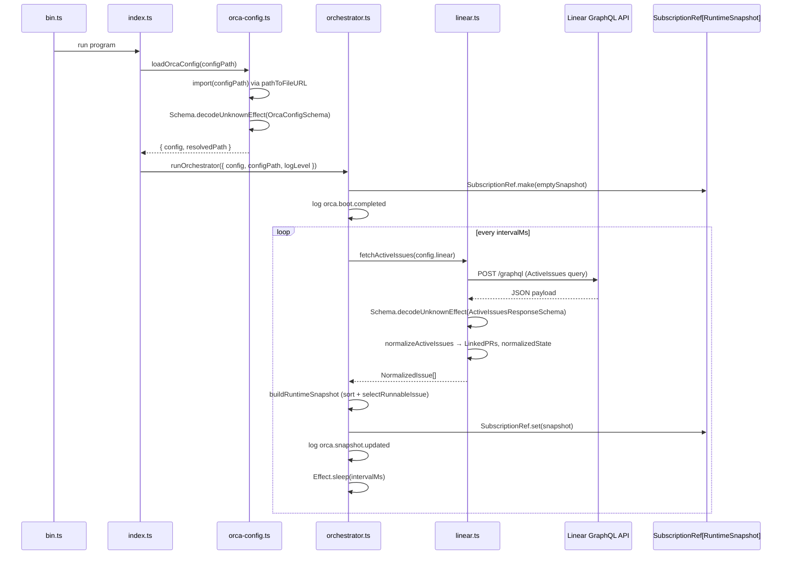

# Pull request review

Identifier: PET-46
Title: Orca bootstrap config and Linear discovery loop

## Original issue description

## What to build

Build the first end-to-end Orca tracer bullet: start from `orca.config.ts`, validate config with `Schema`, poll Linear for active issues, normalize linked PR refs, and maintain an in-memory orchestrator snapshot for a single runnable issue. Reference `SPEC-V2.md` sections 4, 5, 7, 8.1, 8.2, and 11.

## Acceptance criteria

- [ ] Starting Orca with a valid `orca.config.ts` boots successfully and invalid config fails fast with a schema-backed error.
- [ ] Orca polls Linear every 5 seconds, normalizes active issues including linked pull request refs, and selects at most one runnable issue at a time.
- [ ] A runtime snapshot and structured logs show the current normalized issue state, with tests covering config decode and Linear payload normalization.

## Existing pull request

- URL: https://github.com/peterje/orca2/pull/1
- Branch: orca/PET-46-orca-bootstrap-config-and-linear-discovery-loop-2

## Greptile review feedback

# Greptile review

Confidence: 4/5

## Unresolved review threads

<comment author="greptile-apps" path="apps/cli/src/orchestrator.ts">
  <diffHunk><![CDATA[
@@ -0,0 +1,99 @@
+import { Duration, Effect, SubscriptionRef } from "effect"
+import type { RuntimeSnapshot, SelectedRunnableIssue } from "./domain"
+import { formatErrorMessage } from "./error-format"
+import { fetchActiveIssues } from "./linear"
+import type { AppLogLevel } from "./logging"
+import { log } from "./logging"
+import type { OrcaConfig } from "./orca-config"
+
+const compareIssues = (
+  left: RuntimeSnapshot["activeIssues"][number],
+  right: RuntimeSnapshot["activeIssues"][number],
+) => {
+  const priorityDifference = left.priorityRank - right.priorityRank
+  if (priorityDifference !== 0) {
+    return priorityDifference
+  }
+
+  const createdAtDifference =
+    new Date(left.createdAt).getTime() - new Date(right.createdAt).getTime()
+  if (createdAtDifference !== 0) {
+    return createdAtDifference
+  }
+
+  return left.identifier.localeCompare(right.identifier)
+}
+
+export const selectRunnableIssue = (
+  issues: RuntimeSnapshot["activeIssues"],
+): SelectedRunnableIssue | null => {
+  const runnableIssues = issues
+    .filter((issue) => issue.runnable)
+    .sort(compareIssues)
+  const selectedIssue = runnableIssues[0]
+
+  if (!selectedIssue) {
+    return null
+  }
+
+  return {
+    id: selectedIssue.id,
+    identifier: selectedIssue.identifier,
+    title: selectedIssue.title,
+    normalizedState: "runnable",
+  }
+}
+
+export const buildRuntimeSnapshot = (
+  issues: RuntimeSnapshot["activeIssues"],
+): RuntimeSnapshot => ({
+  updatedAt: new Date().toISOString(),
+  activeIssues: [...issues].sort(compareIssues),
+  runnableIssue: selectRunnableIssue(issues),
+})
+
+const logSnapshot = (minimumLogLevel: AppLogLevel, snapshot: RuntimeSnapshot) =>
+  log(minimumLogLevel, "Info", "orca.snapshot.updated", {
+    active_issue_count: snapshot.activeIssues.length,
+    runnable_issue_identifier: snapshot.runnableIssue?.identifier ?? null,
+    snapshot,
+  })
+
+export const runOrchestrator = ({
+  config,
+  configPath,
+  logLevel,
+}: {
+  readonly config: OrcaConfig
+  readonly configPath: string
+  readonly logLevel: AppLogLevel
+}) =>
+  Effect.gen(function* () {
+    const snapshotRef = yield* SubscriptionRef.make<RuntimeSnapshot>({
+      updatedAt: new Date(0).toISOString(),
+      activeIssues: [],
+      runnableIssue: null,
+    })
+
+    yield* log(logLevel, "Info", "orca.boot.completed", {
+      config_path: configPath,
+      polling_interval_ms: config.polling.intervalMs,
+      linear_project_slug: config.linear.projectSlug,
+    })
+
+    const pollOnce = fetchActiveIssues(config.linear).pipe(
+      Effect.map(buildRuntimeSnapshot),
+      Effect.tap((snapshot) => SubscriptionRef.set(snapshotRef, snapshot)),
+      Effect.tap((snapshot) => logSnapshot(logLevel, snapshot)),
+      Effect.catch((error: unknown) =>
+        log(logLevel, "Error", "orca.linear.poll.failed", {
+          message: formatErrorMessage(error),
+        }),
+      ),
+    )
  ]]></diffHunk>
  <lineNumber>93</lineNumber>
  <body>**Polling loop is not resilient to defects**

`Effect.catch` only intercepts typed failures in the `E` channel. If any step inside `fetchActiveIssues` produces an Effect *defect* — an untyped exception such as an unexpected `null` access, an internal runtime error, or a network-layer panic that the HTTP client surfaces as an unchecked throw — the `Effect.catch` handler here will be bypassed entirely. The defect propagates straight through `yield* pollOnce` and terminates the orchestrator fiber with no `orca.linear.poll.failed` log entry and no possibility of continuing to poll.

For a long-running daemon this means a single unexpected error silently kills the process. Wrapping the poll body with `Effect.catchAllCause` would catch both typed failures and defects, keeping the loop alive:

```ts
Effect.catchAllCause((cause) =>
  log(logLevel, "Error", "orca.linear.poll.failed", {
    message: formatErrorMessage(Cause.squash(cause)),
  }),
),
```</body>
</comment>

## General comments

<comments>
  <comment author="greptile-apps">
    <body><h3>Greptile Summary</h3>

This PR introduces the first end-to-end Orca tracer bullet: config loading with `Schema`-backed validation, a Linear GraphQL polling loop, PR-attachment normalization, and an in-memory `RuntimeSnapshot` maintained by the orchestrator. The implementation is well-structured and addresses previous review concerns — `Schema.decodeUnknownEffect` is now used throughout (replacing the `Effect.sync`/`decodeUnknownSync` defect-producing pattern), the `requiredEnvVar` annotation surfaces named env-var errors, and the `NormalizedStateSchema` now correctly includes `"terminal"` as a variant.

Key findings:

- **Polling loop resilience** (`apps/cli/src/orchestrator.ts`): `Effect.catch` only intercepts typed failures; any defect in the poll pipeline will crash the orchestrator fiber silently. `Effect.catchAllCause` is needed to keep the daemon alive across unexpected errors.
- **Missing `test` script** (`apps/cli/package.json`): The `scripts` block has no `"test"` entry. `bun run check` + `bun run build` (the documented verification steps) never execute the test suite, so tests are invisible to CI.
- **`blockers` stub** (`apps/cli/src/linear.ts`): `blockers` is permanently `[]` with no `// TODO` comment. Downstream issues (PET-47–PET-51) depend on this field; the silence makes it easy to forget it is unimplemented.

<h3>Confidence Score: 4/5</h3>

- Safe to merge with minor resilience and process improvements recommended before subsequent daemon-facing tickets land.
- The core logic (schema decoding, issue normalization, priority selection) is correct and well-tested. Previous critical issues (Effect.sync/defect promotion, missing terminal state) have been resolved. The two remaining concerns — defect propagation crashing the polling loop, and missing test script — are real but non-blocking for this tracer-bullet stage.
- `apps/cli/src/orchestrator.ts` (defect handling in poll loop) and `apps/cli/package.json` (missing test script).

<h3>Important Files Changed</h3>


| Filename | Overview |
|----------|----------|
| apps/cli/src/linear.ts | GraphQL query, schema validation (now using `Schema.decodeUnknownEffect`), and issue normalization including the terminal/runnable/linked-pr-detected state machine. The `blockers` field is still a permanent stub (`[]`) with no TODO comment. |
| apps/cli/src/orchestrator.ts | Infinite polling loop with priority-based issue selection. `Effect.catch` only intercepts typed failures — any defect in the poll pipeline will crash the fiber with no logged output and no recovery. |
| apps/cli/src/orca-config.ts | Config loading now correctly uses `Schema.decodeUnknownEffect` and `requiredEnvVar` annotations produce human-readable error messages naming the missing env var. |
| apps/cli/src/domain.ts | Domain schemas look correct. `NormalizedStateSchema` now includes `"terminal"` as a union member. `BlockerRefSchema` is defined but `blockers` is never populated at runtime. |
| apps/cli/package.json | No `test` script defined — the existing Bun test suite cannot be run via `bun run test` and is absent from CI verification steps. |

</details>


<h3>Sequence Diagram</h3>



<!-- greptile_failed_comments -->
<details><summary><h3>Comments Outside Diff (1)</h3></summary>

1. `apps/cli/package.json`, line 17-20 ([link](https://github.com/peterje/orca2/blob/071a7de4e76644a9bef267ad204cff6ee603e001/apps/cli/package.json#L17-L20)) 

   **No `test` script wired into package scripts**

   The PR ships four test files (`linear.test.ts`, `orca-config.test.ts`, `error-format.test.ts`), but `package.json` has no `"test"` script. The PR verification steps only list `bun run check` and `bun run build` — neither of which executes the test suite. Any CI pipeline that relies on `bun run test` will silently skip all tests.

</details>

<!-- /greptile_failed_comments -->

<sub>Last reviewed commit: 071a7de</sub></body>
  </comment>
</comments>

## Repo instructions

# Information
- The base branch for this repository is `main`.
- The package manager used is `bun`.
- The runtime used is Bun

# Learning more about the "effect" & "@effect/\*" packages
`~/.reference/effect-v4` is an authoritative source of information about the
"effect" and "@effect/\*" packages. Read this before looking elsewhere for
information about these packages. It contains the best practices for using
effect. Use this for learning more about the library, rather than browsing the code in
`node_modules/`. Effect provides many utilities and composition patterns: Services and Layers, data strctures, Schema, and even CLI builders. Always search for and leverage Effect-native solutions where possible. Never rewrite your own code that can be modeled with Effect, eg parsing / validation / concurrency.

## Code Style
- use kebab-case for all file names.

# Testing
Test everything with `bun test`

# Git Workflow
- test and typecheck before committing.
- commit directly to main
- always use conventional commits.
- prefer lowercase.
   - "cli", not "CLI"
   - "github", not "GitHub"
   - "http", not "HTTP"
- write commits and descriptions in imperative mood
- all pr commits will be squashed: ensure pr titles follow the same rules as commits
</git>


## Orca execution constraints

- Work only in the current worktree on branch `orca/PET-46-orca-bootstrap-config-and-linear-discovery-loop-2`.
- Base branch is `main`.
- Address the requested Greptile feedback and keep the existing pull request moving.
- Do not ask for permission; pick reasonable defaults and keep going.
- Do not mutate unrelated git state.
- Do not commit secrets or any files under `.orca/`.
- Use a conventional commit message if you create a commit.
- Keep using the existing branch and pull request.

## Verification commands

- `bun run check`
- `bun run build`

## Required git outcome

- Have the existing branch ready for another Greptile review pass.
- Use a conventional commit message every time you create a commit.
- Update the existing pull request instead of creating a new branch or pull request.
- Keep the pull request title unchanged.
- If you update the PR description, keep the same lowercase narrative format with `**closes**`, `**summary**`, and `**verification**`.
- Mention the verification commands you ran in any pull request update you make.
