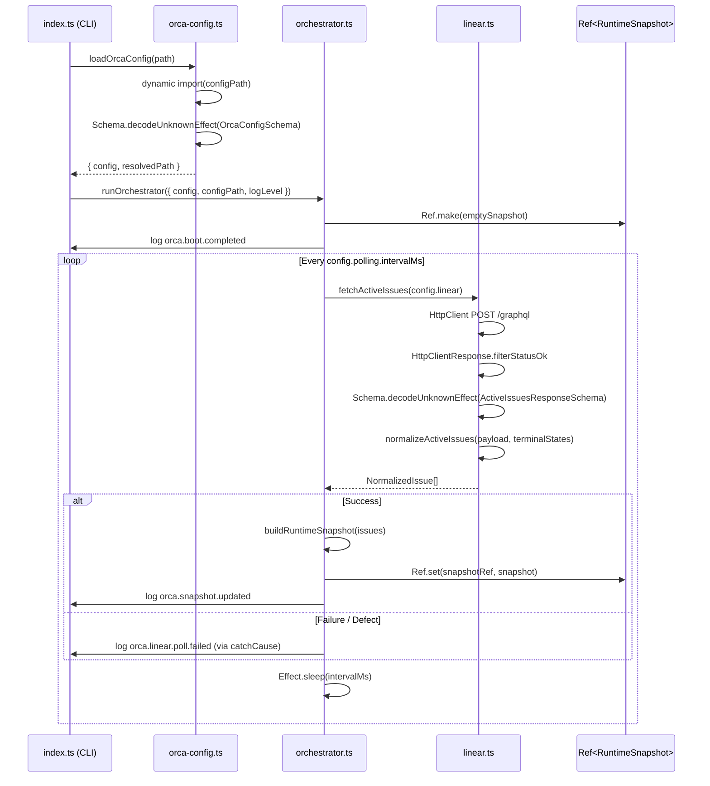

# Pull request review

Identifier: PET-46
Title: Orca bootstrap config and Linear discovery loop

## Original issue description

## What to build

Build the first end-to-end Orca tracer bullet: start from `orca.config.ts`, validate config with `Schema`, poll Linear for active issues, normalize linked PR refs, and maintain an in-memory orchestrator snapshot for a single runnable issue. Reference `SPEC-V2.md` sections 4, 5, 7, 8.1, 8.2, and 11.

## Acceptance criteria

- [ ] Starting Orca with a valid `orca.config.ts` boots successfully and invalid config fails fast with a schema-backed error.
- [ ] Orca polls Linear every 5 seconds, normalizes active issues including linked pull request refs, and selects at most one runnable issue at a time.
- [ ] A runtime snapshot and structured logs show the current normalized issue state, with tests covering config decode and Linear payload normalization.

## Existing pull request

- URL: https://github.com/peterje/orca2/pull/1
- Branch: orca/PET-46-orca-bootstrap-config-and-linear-discovery-loop-2

## Greptile review feedback

# Greptile review

Confidence: 4/5

## Unresolved review threads

<comment author="greptile-apps" path="apps/cli/src/linear.ts">
  <diffHunk><![CDATA[
@@ -0,0 +1,248 @@
+import { Data, Effect, Schema } from "effect"
+import {
+  HttpBody,
+  HttpClient,
+  HttpClientRequest,
+  HttpClientResponse,
+} from "effect/unstable/http"
+import type { LinkedPullRequestRef, NormalizedIssue } from "./domain"
+
+const LabelSchema = Schema.Struct({
+  id: Schema.String,
+  name: Schema.String,
+})
+
+const AttachmentSchema = Schema.Struct({
+  id: Schema.String,
+  title: Schema.NullOr(Schema.String),
+  subtitle: Schema.NullOr(Schema.String),
+  url: Schema.String,
+  metadata: Schema.Unknown,
+  sourceType: Schema.NullOr(Schema.String),
+})
+
+const RawIssueSchema = Schema.Struct({
+  id: Schema.String,
+  identifier: Schema.String,
+  title: Schema.String,
+  description: Schema.NullOr(Schema.String),
+  branchName: Schema.NullOr(Schema.String),
+  priority: Schema.Number,
+  createdAt: Schema.String,
+  updatedAt: Schema.String,
+  state: Schema.Struct({
+    id: Schema.String,
+    name: Schema.String,
+    type: Schema.NullOr(Schema.String),
+  }),
+  labels: Schema.Struct({
+    nodes: Schema.Array(LabelSchema),
+  }),
+  attachments: Schema.Struct({
+    nodes: Schema.Array(AttachmentSchema),
+  }),
+})
+
+type RawIssue = Schema.Schema.Type<typeof RawIssueSchema>
+type RawAttachment = RawIssue["attachments"]["nodes"][number]
+
+const LinearGraphqlErrorSchema = Schema.Struct({
+  message: Schema.String,
+})
+
+export const ActiveIssuesResponseSchema = Schema.Struct({
+  data: Schema.NullOr(
+    Schema.Struct({
+      issues: Schema.Struct({
+        nodes: Schema.Array(RawIssueSchema),
+      }),
+    }),
+  ),
+  errors: Schema.optional(Schema.Array(LinearGraphqlErrorSchema)),
+})
+
+export type ActiveIssuesResponse = Schema.Schema.Type<
+  typeof ActiveIssuesResponseSchema
+>
+
+export class LinearApiError extends Data.TaggedError("LinearApiError")<{
+  readonly message: string
+}> {}
+
+export const decodeActiveIssuesResponse = (input: unknown) =>
+  Schema.decodeUnknownEffect(ActiveIssuesResponseSchema)(input)
+
+const activeIssuesQuery = `
+  query ActiveIssues($projectSlug: String!, $activeStates: [String!]!) {
+    issues(
+      first: 100
+      filter: {
+        project: { slug: { eq: $projectSlug } }
+        state: { name: { in: $activeStates } }
+      }
+    ) {
+      nodes {
+        id
+        identifier
+        title
+        description
+        branchName
+        priority
+        createdAt
+        updatedAt
+        state {
+          id
+          name
+          type
+        }
+        labels {
+          nodes {
+            id
+            name
+          }
+        }
+        attachments {
+          nodes {
+            id
+            title
+            subtitle
+            url
+            metadata
+            sourceType
+          }
+        }
+      }
+    }
+  }
+`
+
+const pullRequestUrlPattern =
+  /^https:\/\/github\.com\/([^/]+)\/([^/]+)\/pull\/(\d+)(?:[/?#].*)?$/i
+
+const normalizeLinkedPullRequests = (
+  attachments: ReadonlyArray<RawAttachment>,
+): Array<LinkedPullRequestRef> => {
+  const deduped = new Map<string, LinkedPullRequestRef>()
+
+  for (const attachment of attachments) {
+    const match = attachment.url.match(pullRequestUrlPattern)
+    if (!match) {
+      continue
+    }
+
+    const [, owner, repo, numberText] = match
+    if (!owner || !repo || !numberText) {
+      continue
+    }
+
+    const number = Number(numberText)
+    const key = `${owner}/${repo}#${number}`
+
+    if (deduped.has(key)) {
+      continue
+    }
+
+    deduped.set(key, {
+      provider: "github",
+      owner,
+      repo,
+      number,
+      url: attachment.url,
+      title: attachment.title,
+      attachmentId: attachment.id,
+    })
+  }
+
+  return [...deduped.values()].sort((left, right) => left.number - right.number)
+}
+
+const toPriorityRank = (priority: number) => (priority > 0 ? priority : 5)
+
+export const normalizeActiveIssues = (
+  response: ActiveIssuesResponse,
+  terminalStates: ReadonlyArray<string>,
+): Array<NormalizedIssue> => {
+  const nodes = response.data?.issues.nodes ?? []
+
+  return nodes.map((issue) => {
+    const linkedPullRequests = normalizeLinkedPullRequests(
+      issue.attachments.nodes,
+    )
+    const terminal =
+      terminalStates.includes(issue.state.name) ||
+      issue.state.type === "completed"
  ]]></diffHunk>
  <lineNumber>173</lineNumber>
  <body>**`state.type === "cancelled"` missing from terminal check**

The terminal guard checks `state.type === "completed"` but not `state.type === "cancelled"`. In Linear's schema, both `"completed"` and `"cancelled"` are terminal state types — they differ in meaning ("done" vs "cancelled"), but neither should be treated as a workable issue.

If a workspace has a state whose `type` is `"cancelled"` but whose `name` is not listed in `config.terminalStates`, that issue would pass through as `runnable: true` (no linked PR) and potentially be selected by the orchestrator.

In the default config, `terminalStates` already includes `"Cancelled"` / `"Canceled"`, so this is low-risk for the out-of-the-box setup. But the type-based check is meant to be a defensive backstop and should cover both Linear terminal types:

```suggestion
    const terminal =
      terminalStates.includes(issue.state.name) ||
      issue.state.type === "completed" ||
      issue.state.type === "cancelled"
```</body>
</comment>

## General comments

<comments>
  <comment author="greptile-apps">
    <body><h3>Greptile Summary</h3>

This PR implements the end-to-end Orca tracer bullet: config loading and validation with Effect Schema, a Linear GraphQL polling loop, PR-attachment normalization, and an in-memory orchestrator snapshot — covering acceptance criteria from PET-46.

Key changes and observations:
- **Config loading** (`orca-config.ts`): Uses `Schema.decodeUnknownEffect` for typed failure propagation; `requiredEnvVar` helper annotates missing env var fields with human-readable messages.
- **Linear normalization** (`linear.ts`): GraphQL query, attachment-based PR deduplication, `toPriorityRank` priority mapping, and `normalizeActiveIssues` are all sound. One issue: the terminal-state type guard checks `state.type === "completed"` but omits `state.type === "cancelled"` — see inline comment.
- **Orchestrator** (`orchestrator.ts`): Polling loop uses `Effect.catchCause` (catches both typed failures and defects), `Ref.make` for snapshot state, and a NaN-safe date comparator — addressing the key concerns from the previous review.
- **Domain** (`domain.ts`): `NormalizedStateSchema` correctly includes `"terminal"`, `attachmentId` is non-nullable, and `blockers` is stubbed with a `TODO` comment for future dependency discovery.
- **Tests**: Good coverage across config decode, Linear payload normalization, terminal/runnable classification, priority+age sort, and the NaN-date fallback path.

<h3>Confidence Score: 4/5</h3>

- Safe to merge with one minor fix recommended for the missing `state.type === "cancelled"` terminal guard.
- The most significant issues from the prior review round (Effect.sync/defect leakage, SubscriptionRef overhead, NaN sort, nullable attachmentId, missing "terminal" state) have all been addressed. One new logic gap remains: the terminal-state type guard is incomplete, which could misclassify a cancelled issue as runnable in non-default workspace configurations. It is low risk for the default setup but should be fixed before the polling loop handles real issues.
- `apps/cli/src/linear.ts` — the `normalizeActiveIssues` terminal check at line 172–173.

<h3>Important Files Changed</h3>


| Filename | Overview |
|----------|----------|
| apps/cli/src/linear.ts | Implements the Linear GraphQL query, payload decoding (now correctly using `Schema.decodeUnknownEffect`), and normalization logic. One new issue: the terminal-state guard only checks `state.type === "completed"` and misses `state.type === "cancelled"`, which could misclassify cancelled issues as runnable in edge-case workspace configurations. |
| apps/cli/src/orchestrator.ts | Implements the polling loop and runtime snapshot management. Uses `Effect.catchCause` (catching both typed failures and defects), `Ref.make` for the snapshot, and a guarded NaN-safe date comparator — addressing the key issues raised in previous review threads. |
| apps/cli/src/orca-config.ts | Config loading and schema validation using `Schema.decodeUnknownEffect`. The `requiredEnvVar` helper annotates the schema with a descriptive message for missing env vars. Previous issues with `Effect.sync`/`decodeUnknownSync` have been resolved. |
| apps/cli/src/domain.ts | Defines the core domain schemas and types. `NormalizedStateSchema` correctly includes the `"terminal"` variant. `attachmentId` is now typed as `Schema.String` (non-nullable), tightening the type appropriately. `blockers` remains a stub with a TODO comment. |
| apps/cli/src/index.ts | CLI entry point wiring config loading, orchestrator startup, and top-level error formatting. Straightforward and correct. |
| apps/cli/src/error-format.ts | Simple error formatting utility covering schema errors, config load errors, and generic errors. Clean and well-tested. |
| apps/cli/src/logging.ts | Structured JSON logger with severity filtering. Correctly routes errors/fatals to stderr and everything else to stdout. |
| orca.config.ts | Repository-level Orca configuration using `process.env` for API keys. Fails fast with a schema error when env vars are missing. |

</details>


<h3>Sequence Diagram</h3>



<!-- greptile_other_comments_section -->

<sub>Last reviewed commit: 3ed170f</sub></body>
  </comment>
</comments>

## Repo instructions

# Information
- The base branch for this repository is `main`.
- The package manager used is `bun`.
- The runtime used is Bun

# Learning more about the "effect" & "@effect/\*" packages
`~/.reference/effect-v4` is an authoritative source of information about the
"effect" and "@effect/\*" packages. Read this before looking elsewhere for
information about these packages. It contains the best practices for using
effect. Use this for learning more about the library, rather than browsing the code in
`node_modules/`. Effect provides many utilities and composition patterns: Services and Layers, data strctures, Schema, and even CLI builders. Always search for and leverage Effect-native solutions where possible. Never rewrite your own code that can be modeled with Effect, eg parsing / validation / concurrency.

## Code Style
- use kebab-case for all file names.

# Testing
Test everything with `bun test`

# Git Workflow
- test and typecheck before committing.
- commit directly to main
- always use conventional commits.
- prefer lowercase.
   - "cli", not "CLI"
   - "github", not "GitHub"
   - "http", not "HTTP"
- write commits and descriptions in imperative mood
- all pr commits will be squashed: ensure pr titles follow the same rules as commits
</git>


## Orca execution constraints

- Work only in the current worktree on branch `orca/PET-46-orca-bootstrap-config-and-linear-discovery-loop-2`.
- Base branch is `main`.
- Address the requested Greptile feedback and keep the existing pull request moving.
- Do not ask for permission; pick reasonable defaults and keep going.
- Do not mutate unrelated git state.
- Do not commit secrets or any files under `.orca/`.
- Use a conventional commit message if you create a commit.
- Keep using the existing branch and pull request.

## Verification commands

- `bun run check`
- `bun run build`

## Required git outcome

- Have the existing branch ready for another Greptile review pass.
- Use a conventional commit message every time you create a commit.
- Update the existing pull request instead of creating a new branch or pull request.
- Keep the pull request title unchanged.
- If you update the PR description, keep the same lowercase narrative format with `**closes**`, `**summary**`, and `**verification**`.
- Mention the verification commands you ran in any pull request update you make.
