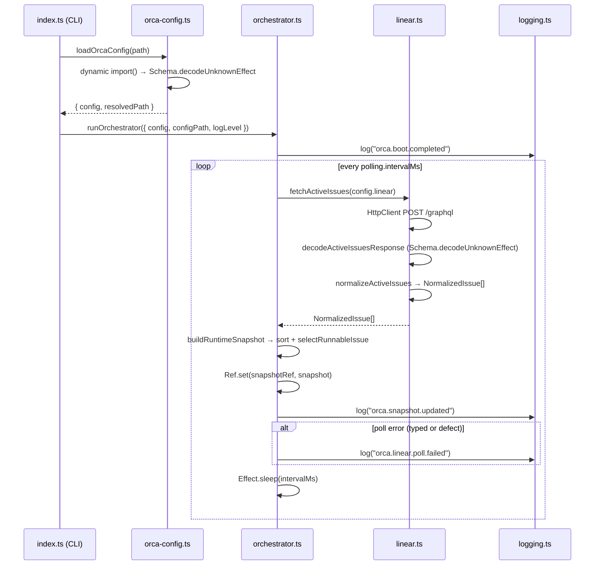

# Pull request review

Identifier: PET-46
Title: Orca bootstrap config and Linear discovery loop

## Original issue description

## What to build

Build the first end-to-end Orca tracer bullet: start from `orca.config.ts`, validate config with `Schema`, poll Linear for active issues, normalize linked PR refs, and maintain an in-memory orchestrator snapshot for a single runnable issue. Reference `SPEC-V2.md` sections 4, 5, 7, 8.1, 8.2, and 11.

## Acceptance criteria

- [ ] Starting Orca with a valid `orca.config.ts` boots successfully and invalid config fails fast with a schema-backed error.
- [ ] Orca polls Linear every 5 seconds, normalizes active issues including linked pull request refs, and selects at most one runnable issue at a time.
- [ ] A runtime snapshot and structured logs show the current normalized issue state, with tests covering config decode and Linear payload normalization.

## Existing pull request

- URL: https://github.com/peterje/orca2/pull/1
- Branch: orca/PET-46-orca-bootstrap-config-and-linear-discovery-loop-2

## Greptile review feedback

# Greptile review

Confidence: 4/5

## Unresolved review threads

<comment author="greptile-apps" path="apps/cli/src/logging.ts">
  <diffHunk><![CDATA[
@@ -0,0 +1,50 @@
+import { Effect } from "effect"
+
+export const appLogLevels = [
+  "Fatal",
+  "Error",
+  "Warn",
+  "Info",
+  "Debug",
+  "Trace",
+] as const
+
+export type AppLogLevel = (typeof appLogLevels)[number]
+
+const severityOrder: Readonly<Record<AppLogLevel, number>> = {
+  Fatal: 0,
+  Error: 1,
+  Warn: 2,
+  Info: 3,
+  Debug: 4,
+  Trace: 5,
+}
+
+const shouldLog = (minimumLevel: AppLogLevel, messageLevel: AppLogLevel) =>
+  severityOrder[messageLevel] <= severityOrder[minimumLevel]
+
+export const log = (
+  minimumLevel: AppLogLevel,
+  messageLevel: AppLogLevel,
+  event: string,
+  fields: Record<string, unknown>,
+) =>
+  Effect.sync(() => {
+    if (!shouldLog(minimumLevel, messageLevel)) {
+      return
+    }
+
+    const line = JSON.stringify({
+      timestamp: new Date().toISOString(),
+      level: messageLevel,
+      event,
+      ...fields,
+    })
+
  ]]></diffHunk>
  <lineNumber>43</lineNumber>
  <body>**`...fields` spread placed after reserved keys, allowing silent overwrites**

The `...fields` spread is placed _after_ `timestamp`, `level`, and `event`. This means any caller that passes a field named `timestamp`, `level`, or `event` will silently overwrite the structured log metadata.

For example, a future log call like:
```ts
log(logLevel, "Info", "orca.something", { event: "custom-event", level: "Fatal" })
```
would replace `level` with `"Fatal"` in the JSON output, even if the message severity is `"Info"`.

The reserved keys should come _last_ so they always win:

```suggestion
    const line = JSON.stringify({
      ...fields,
      timestamp: new Date().toISOString(),
      level: messageLevel,
      event,
    })
```</body>
</comment>

## General comments

<comments>
  <comment author="greptile-apps">
    <body><h3>Greptile Summary</h3>

This PR delivers the first end-to-end Orca tracer bullet: config validation via Effect Schema, a Linear GraphQL polling loop, issue normalization (PR attachment detection, terminal state classification, priority sorting), a runtime snapshot with structured logging, and a suite of unit tests. It also resolves all previously flagged issues from the last review cycle — `Effect.sync`/`decodeUnknownSync` replaced with `Schema.decodeUnknownEffect`, the polling loop upgraded to `Effect.catchCause` for defect resilience, `SubscriptionRef` swapped for a plain `Ref`, the date comparator guarded with `Number.isFinite`, `"cancelled"` added to the terminal check, `"terminal"` added to `NormalizedStateSchema`, `attachmentId` tightened to non-nullable, and a `// TODO` added for the `blockers` stub.

**Key changes:**
- `apps/cli/src/linear.ts` — GraphQL query, `normalizeActiveIssues`, and `fetchActiveIssues` with HTTP client wiring
- `apps/cli/src/orchestrator.ts` — `runOrchestrator` polling loop with `Effect.catchCause`, `buildRuntimeSnapshot`, and `selectRunnableIssue`
- `apps/cli/src/orca-config.ts` — `OrcaConfigSchema` with `requiredEnvVar` annotation helper and `loadOrcaConfig` using dynamic `import()`
- `apps/cli/src/domain.ts` — Domain schemas for `NormalizedIssue`, `LinkedPullRequestRef`, `RuntimeSnapshot`
- `apps/cli/src/logging.ts` — Structured JSON logger; contains one **spread-order bug** where `...fields` comes after reserved keys (`timestamp`, `level`, `event`), allowing callers to silently overwrite log metadata — fix is to put `...fields` first

<h3>Confidence Score: 4/5</h3>

- Safe to merge after fixing the spread-order bug in logging.ts; all prior review issues have been addressed.
- The PR resolves every issue from the previous review round and is well-tested. The one new finding — `...fields` spread overwriting reserved log keys — is a real correctness bug but low-severity today since existing call sites don't collide with the reserved names. It will silently corrupt logs if future log calls add a `level`, `event`, or `timestamp` field.
- apps/cli/src/logging.ts — spread order puts user fields after reserved keys, allowing silent overwrite of log metadata.

<h3>Important Files Changed</h3>


| Filename | Overview |
|----------|----------|
| apps/cli/src/logging.ts | Structured logging helper — spread order bug allows user-provided fields to silently overwrite reserved log keys (timestamp, level, event). |
| apps/cli/src/linear.ts | Linear API client and issue normalization — previous issues (Effect.sync, terminal state, blockers TODO, cancelled type) all addressed in this revision. |
| apps/cli/src/orchestrator.ts | Polling loop using Ref, Effect.catchCause for resilience, and Number.isFinite guard in comparator — all prior review concerns resolved. |
| apps/cli/src/orca-config.ts | Config schema uses Schema.decodeUnknownEffect (not sync), requiredEnvVar helper added for named annotation messages. |
| apps/cli/src/domain.ts | Domain schemas look clean — NormalizedStateSchema now includes "terminal", attachmentId is non-nullable Schema.String. |

</details>


<h3>Sequence Diagram</h3>



<!-- greptile_other_comments_section -->

<sub>Last reviewed commit: ba1cab9</sub></body>
  </comment>
</comments>

## Repo instructions

# Information
- The base branch for this repository is `main`.
- The package manager used is `bun`.
- The runtime used is Bun

# Learning more about the "effect" & "@effect/\*" packages
`~/.reference/effect-v4` is an authoritative source of information about the
"effect" and "@effect/\*" packages. Read this before looking elsewhere for
information about these packages. It contains the best practices for using
effect. Use this for learning more about the library, rather than browsing the code in
`node_modules/`. Effect provides many utilities and composition patterns: Services and Layers, data strctures, Schema, and even CLI builders. Always search for and leverage Effect-native solutions where possible. Never rewrite your own code that can be modeled with Effect, eg parsing / validation / concurrency.

## Code Style
- use kebab-case for all file names.

# Testing
Test everything with `bun test`

# Git Workflow
- test and typecheck before committing.
- commit directly to main
- always use conventional commits.
- prefer lowercase.
   - "cli", not "CLI"
   - "github", not "GitHub"
   - "http", not "HTTP"
- write commits and descriptions in imperative mood
- all pr commits will be squashed: ensure pr titles follow the same rules as commits
</git>


## Orca execution constraints

- Work only in the current worktree on branch `orca/PET-46-orca-bootstrap-config-and-linear-discovery-loop-2`.
- Base branch is `main`.
- Address the requested Greptile feedback and keep the existing pull request moving.
- Do not ask for permission; pick reasonable defaults and keep going.
- Do not mutate unrelated git state.
- Do not commit secrets or any files under `.orca/`.
- Use a conventional commit message if you create a commit.
- Keep using the existing branch and pull request.

## Verification commands

- `bun run check`
- `bun run build`

## Required git outcome

- Have the existing branch ready for another Greptile review pass.
- Use a conventional commit message every time you create a commit.
- Update the existing pull request instead of creating a new branch or pull request.
- Keep the pull request title unchanged.
- If you update the PR description, keep the same lowercase narrative format with `**closes**`, `**summary**`, and `**verification**`.
- Mention the verification commands you ran in any pull request update you make.
