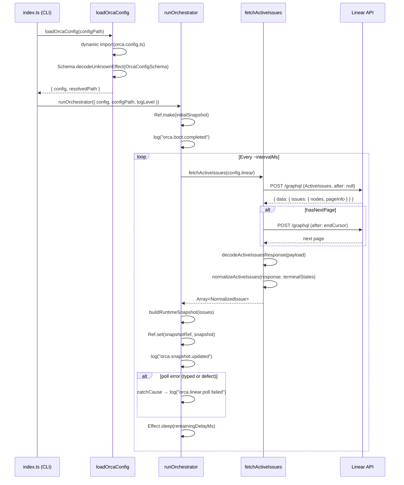

# Pull request review

Identifier: PET-46
Title: Orca bootstrap config and Linear discovery loop

## Original issue description

## What to build

Build the first end-to-end Orca tracer bullet: start from `orca.config.ts`, validate config with `Schema`, poll Linear for active issues, normalize linked PR refs, and maintain an in-memory orchestrator snapshot for a single runnable issue. Reference `SPEC-V2.md` sections 4, 5, 7, 8.1, 8.2, and 11.

## Acceptance criteria

- [ ] Starting Orca with a valid `orca.config.ts` boots successfully and invalid config fails fast with a schema-backed error.
- [ ] Orca polls Linear every 5 seconds, normalizes active issues including linked pull request refs, and selects at most one runnable issue at a time.
- [ ] A runtime snapshot and structured logs show the current normalized issue state, with tests covering config decode and Linear payload normalization.

## Existing pull request

- URL: https://github.com/peterje/orca2/pull/1
- Branch: orca/PET-46-orca-bootstrap-config-and-linear-discovery-loop-2

## Greptile review feedback

# Greptile review

Confidence: 4/5

## General comments

<comments>
  <comment author="greptile-apps">
    <body><h3>Greptile Summary</h3>

This PR delivers the first end-to-end Orca tracer bullet: schema-validated config loading, a paginated Linear polling loop, issue normalization with linked PR deduplication, a priority-ranked orchestrator snapshot, and structured NDJSON logging throughout. It directly implements the acceptance criteria from PET-46.

**What was addressed from prior review threads:**
- `Schema.decodeUnknownEffect` is now used consistently in both `orca-config.ts` and `linear.ts`, so `ParseError` reaches the typed `E` channel and is formatted correctly on boot failure
- Pagination is fully implemented in `fetchActiveIssues` via a `while`/`pageInfo` loop — the `first: 100` truncation concern is resolved
- `normalizedState` correctly carries a three-way `"runnable" | "linked-pr-detected" | "terminal"` union, including the `"cancelled"` state type as a terminal guard
- `attachmentId` is updated alongside `title` when a null-title deduplication upgrade fires (test at `linear.test.ts:143` confirms `"attachment-11"`)
- `catchCause` correctly re-raises interrupt causes via `Cause.hasInterrupts`, enabling clean SIGTERM shutdown
- Poll interval now measures elapsed wall-clock time and sleeps only the remainder, keeping cadence close to `intervalMs`
- `snapshotRef` is a plain `Ref` (not `SubscriptionRef`); the pub/sub overhead concern is gone
- Startup errors now route through `writeLogLine` for consistent NDJSON output
- Duplicate `"./logging"` imports are merged into one statement
- `requiredScore` is set to `4` to match the actual Greptile review confidence for this PR

**Remaining known items (tracked in prior threads, not new):**
- The `message` annotation on `requiredEnvVar` is a plain string rather than a `(issue: ParseIssue) => string` function; the `identifier` annotation carries the env-var name into error output and is what the tests assert against
- `blockers: []` is a documented stub with a `// TODO` comment pending the dependency-discovery milestone

<h3>Confidence Score: 4/5</h3>

- PR is safe to merge — all previously flagged critical issues have been addressed; remaining items are known stubs or minor annotation nuances tracked in prior threads.
- All blocking concerns from the previous review round (sync decoders producing defects, missing pagination, interrupt swallowing, poll-interval drift, attachmentId/title mismatch, missing "terminal" state) have been resolved in this iteration. The two remaining open items — the `message` annotation as a plain string and the `blockers: []` stub — are low-risk and already documented. No new logic bugs were found during this review.
- No files require special attention. `apps/cli/src/orca-config.ts` carries the known `message` annotation issue but it does not affect correctness of the error output as asserted by the existing tests.

<h3>Important Files Changed</h3>

| Filename | Overview |
|----------|----------|
| apps/cli/src/linear.ts | Core Linear API integration: implements paginated `fetchActiveIssues`, schema-safe `decodeActiveIssuesResponse`, PR-ref deduplication with null-title preference, and full three-way `normalizedState` classification including `"cancelled"` type detection. Previously flagged issues (sync decoder, missing pagination, attachmentId mismatch, `cancelled` terminal guard) are all addressed. |
| apps/cli/src/orchestrator.ts | Polling loop correctly re-raises interrupt causes via `Cause.hasInterrupts`, measures elapsed time to maintain consistent poll cadence, uses plain `Ref` instead of `SubscriptionRef`, and catches all causes including defects. All previously flagged concerns (interrupt swallowing, NaN sort, poll interval drift, SubscriptionRef overhead) have been addressed. |
| apps/cli/src/orca-config.ts | Config decoding now correctly uses `Schema.decodeUnknownEffect` (typed failure, not defect). The `requiredEnvVar` helper annotates the schema with `identifier` (which drives error string output) and `message`. The `message` value is a plain string rather than a function — a known concern flagged in a prior thread. |
| apps/cli/src/index.ts | Startup errors now route through structured `writeLogLine` (NDJSON), resolving the plain-text vs JSON inconsistency flagged previously. Duplicate imports from `"./logging"` have been collapsed into a single statement. Layering of `BunServices` and `FetchHttpClient` looks correct. |
| apps/cli/src/domain.ts | Schemas look clean: `NormalizedStateSchema` now includes the `"terminal"` literal, `attachmentId` is `Schema.String` (non-nullable, consistent with `normalizeLinkedPullRequests`), and the redundant `runnable: boolean` field has been removed from `NormalizedIssueSchema`. |

<h3>Sequence Diagram</h3>

<!-- greptile_other_comments_section -->

Last reviewed commit: cf12b98</body>
  </comment>
</comments>

## Repo instructions

# Information
- The base branch for this repository is `main`.
- The package manager used is `bun`.
- The runtime used is Bun

# Learning more about the "effect" & "@effect/\*" packages
`~/.reference/effect-v4` is an authoritative source of information about the
"effect" and "@effect/\*" packages. Read this before looking elsewhere for
information about these packages. It contains the best practices for using
effect. Use this for learning more about the library, rather than browsing the code in
`node_modules/`. Effect provides many utilities and composition patterns: Services and Layers, data strctures, Schema, and even CLI builders. Always search for and leverage Effect-native solutions where possible. Never rewrite your own code that can be modeled with Effect, eg parsing / validation / concurrency.

## Code Style
- use kebab-case for all file names.

# Testing
Test everything with `bun test`

# Git Workflow
- test and typecheck before committing.
- commit directly to main
- always use conventional commits.
- prefer lowercase.
   - "cli", not "CLI"
   - "github", not "GitHub"
   - "http", not "HTTP"
- write commits and descriptions in imperative mood
- all pr commits will be squashed: ensure pr titles follow the same rules as commits
</git>

## Orca execution constraints

- Work only in the current worktree on branch `orca/PET-46-orca-bootstrap-config-and-linear-discovery-loop-2`.
- Base branch is `main`.
- Address the requested Greptile feedback and keep the existing pull request moving.
- Do not ask for permission; pick reasonable defaults and keep going.
- Do not mutate unrelated git state.
- Do not commit secrets or any files under `.orca/`.
- Use a conventional commit message if you create a commit.
- Keep using the existing branch and pull request.

## Verification commands

- `bun run check`
- `bun run build`

## Required git outcome

- Have the existing branch ready for another Greptile review pass.
- Use a conventional commit message every time you create a commit.
- Update the existing pull request instead of creating a new branch or pull request.
- Keep the pull request title unchanged.
- If you update the PR description, keep the same lowercase narrative format with `**closes**`, `**summary**`, and `**verification**`.
- Mention the verification commands you ran in any pull request update you make.
