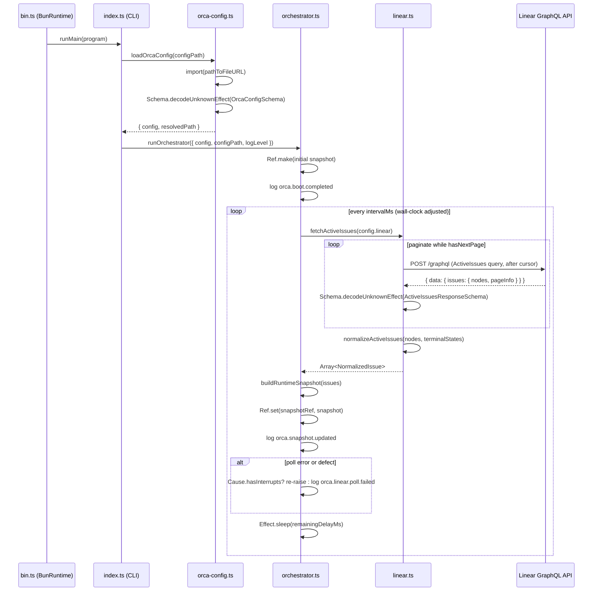

# Pull request review

Identifier: PET-46
Title: Orca bootstrap config and Linear discovery loop

## Original issue description

## What to build

Build the first end-to-end Orca tracer bullet: start from `orca.config.ts`, validate config with `Schema`, poll Linear for active issues, normalize linked PR refs, and maintain an in-memory orchestrator snapshot for a single runnable issue. Reference `SPEC-V2.md` sections 4, 5, 7, 8.1, 8.2, and 11.

## Acceptance criteria

- [ ] Starting Orca with a valid `orca.config.ts` boots successfully and invalid config fails fast with a schema-backed error.
- [ ] Orca polls Linear every 5 seconds, normalizes active issues including linked pull request refs, and selects at most one runnable issue at a time.
- [ ] A runtime snapshot and structured logs show the current normalized issue state, with tests covering config decode and Linear payload normalization.

## Existing pull request

- URL: https://github.com/peterje/orca2/pull/1
- Branch: orca/PET-46-orca-bootstrap-config-and-linear-discovery-loop-2

## Greptile review feedback

# Greptile review

Confidence: 4/5

## Unresolved review threads

<comment author="greptile-apps" path="apps/cli/src/linear.ts">
  <diffHunk><![CDATA[
@@ -0,0 +1,342 @@
+import { Data, Effect, Schema } from "effect"
+import {
+  HttpBody,
+  HttpClient,
+  HttpClientRequest,
+  HttpClientResponse,
+} from "effect/unstable/http"
+import type { LinkedPullRequestRef, NormalizedIssue } from "./domain"
+
+const LabelSchema = Schema.Struct({
+  id: Schema.String,
+  name: Schema.String,
+})
+
+const AttachmentSchema = Schema.Struct({
+  id: Schema.String,
+  title: Schema.NullOr(Schema.String),
+  subtitle: Schema.NullOr(Schema.String),
+  url: Schema.String,
+  metadata: Schema.Unknown,
+  sourceType: Schema.NullOr(Schema.String),
+})
+
+const RawIssueSchema = Schema.Struct({
+  id: Schema.String,
+  identifier: Schema.String,
+  title: Schema.String,
+  description: Schema.NullOr(Schema.String),
+  branchName: Schema.NullOr(Schema.String),
+  priority: Schema.Number,
+  createdAt: Schema.String,
+  updatedAt: Schema.String,
+  state: Schema.Struct({
+    id: Schema.String,
+    name: Schema.String,
+    type: Schema.NullOr(Schema.String),
+  }),
+  labels: Schema.Struct({
+    nodes: Schema.Array(LabelSchema),
+  }),
+  attachments: Schema.Struct({
+    nodes: Schema.Array(AttachmentSchema),
+  }),
+})
+
+type RawIssue = Schema.Schema.Type<typeof RawIssueSchema>
+type RawAttachment = RawIssue["attachments"]["nodes"][number]
+type ActiveIssuesPage = NonNullable<ActiveIssuesResponse["data"]>["issues"]
+
+const PageInfoSchema = Schema.Struct({
+  hasNextPage: Schema.Boolean,
+  endCursor: Schema.NullOr(Schema.String),
+})
+
+const LinearGraphqlErrorSchema = Schema.Struct({
+  message: Schema.String,
+})
+
+export const ActiveIssuesResponseSchema = Schema.Struct({
+  data: Schema.NullOr(
+    Schema.Struct({
+      issues: Schema.Struct({
+        nodes: Schema.Array(RawIssueSchema),
+        pageInfo: PageInfoSchema,
+      }),
+    }),
+  ),
+  errors: Schema.optional(Schema.Array(LinearGraphqlErrorSchema)),
+})
+
+export type ActiveIssuesResponse = Schema.Schema.Type<
+  typeof ActiveIssuesResponseSchema
+>
+
+export class LinearApiError extends Data.TaggedError("LinearApiError")<{
+  readonly message: string
+}> {}
+
+export const decodeActiveIssuesResponse = (input: unknown) =>
+  Schema.decodeUnknownEffect(ActiveIssuesResponseSchema)(input)
+
+const activeIssuesQuery = `
+  query ActiveIssues($projectSlug: String!, $activeStates: [String!]!, $after: String) {
+    issues(
+      first: 100
+      after: $after
+      filter: {
+        project: { slug: { eq: $projectSlug } }
+        state: { name: { in: $activeStates } }
+      }
+    ) {
+      pageInfo {
+        hasNextPage
+        endCursor
+      }
+      nodes {
+        id
+        identifier
+        title
+        description
+        branchName
+        priority
+        createdAt
+        updatedAt
+        state {
+          id
+          name
+          type
+        }
+        labels {
+          nodes {
+            id
+            name
+          }
+        }
+        attachments {
+          nodes {
+            id
+            title
+            subtitle
+            url
+            metadata
+            sourceType
+          }
+        }
+      }
+    }
+  }
+`
+
+const pullRequestUrlPattern =
+  /^https:\/\/github\.com\/([^/]+)\/([^/]+)\/pull\/(\d+)(?:[/?#].*)?$/i
+
+const toLinkedPullRequestRef = ({
+  attachment,
+  owner,
+  repo,
+  number,
+}: {
+  readonly attachment: RawAttachment
+  readonly owner: string
+  readonly repo: string
+  readonly number: number
+}): LinkedPullRequestRef => ({
+  provider: "github",
+  owner,
+  repo,
+  number,
+  url: attachment.url,
+  title: attachment.title,
+  attachmentId: attachment.id,
+})
+
+const normalizeLinkedPullRequests = (
+  attachments: ReadonlyArray<RawAttachment>,
+): Array<LinkedPullRequestRef> => {
+  const deduped = new Map<string, LinkedPullRequestRef>()
+
+  for (const attachment of attachments) {
+    const match = attachment.url.match(pullRequestUrlPattern)
+    if (!match) {
+      continue
+    }
+
+    const [, owner, repo, numberText] = match
+    if (!owner || !repo || !numberText) {
+      continue
+    }
+
+    const number = Number(numberText)
+    const key = `${owner}/${repo}#${number}`
+
+    const existing = deduped.get(key)
+    if (existing) {
+      if (existing.title === null && attachment.title !== null) {
+        deduped.set(
+          key,
+          toLinkedPullRequestRef({
+            attachment,
+            owner,
+            repo,
+            number,
+          }),
+        )
+      }
+
+      continue
+    }
+
+    deduped.set(
+      key,
+      toLinkedPullRequestRef({
+        attachment,
+        owner,
+        repo,
+        number,
+      }),
+    )
+  }
+
+  return [...deduped.values()].sort((left, right) => left.number - right.number)
+}
+
+const toPriorityRank = (priority: number) => (priority > 0 ? priority : 5)
+
+export const normalizeActiveIssues = (
+  response: ActiveIssuesResponse,
+  terminalStates: ReadonlyArray<string>,
+): Array<NormalizedIssue> => {
+  const nodes = response.data?.issues.nodes ?? []
+
+  return nodes.map((issue) => {
+    const linkedPullRequests = normalizeLinkedPullRequests(
+      issue.attachments.nodes,
+    )
+    const terminal =
+      terminalStates.includes(issue.state.name) ||
+      issue.state.type === "completed" ||
+      issue.state.type === "cancelled"
+    const runnable = !terminal && linkedPullRequests.length === 0
+    const normalizedState = terminal
+      ? "terminal"
+      : runnable
+        ? "runnable"
+        : "linked-pr-detected"
+
+    return {
+      id: issue.id,
+      identifier: issue.identifier,
+      title: issue.title,
+      description: issue.description,
+      branchName: issue.branchName,
+      priority: issue.priority,
+      priorityRank: toPriorityRank(issue.priority),
+      createdAt: issue.createdAt,
+      updatedAt: issue.updatedAt,
+      stateName: issue.state.name,
+      stateType: issue.state.type,
+      labels: issue.labels.nodes.map((label) => label.name).sort(),
+      linkedPullRequests,
+      blockers: [], // TODO: populate blockers once dependency discovery lands.
+      normalizedState,
+    }
+  })
+}
+
+const fetchActiveIssuesPage = ({
+  config,
+  after,
+}: {
+  readonly config: LinearConfig
+  readonly after: string | null
+}) =>
+  Effect.gen(function* () {
+    const body = yield* HttpBody.json({
+      query: activeIssuesQuery,
+      variables: {
+        projectSlug: config.projectSlug,
+        activeStates: [...config.activeStates],
+        after,
+      },
+    })
+
+    const response = yield* HttpClient.execute(
+      HttpClientRequest.post(config.endpoint).pipe(
+        HttpClientRequest.acceptJson,
+        HttpClientRequest.setHeader("Authorization", config.apiKey),
+        HttpClientRequest.setHeader("Content-Type", "application/json"),
+        HttpClientRequest.modify({ body }),
+      ),
+    ).pipe(Effect.flatMap(HttpClientResponse.filterStatusOk))
+
+    const payload = yield* response.json.pipe(
+      Effect.flatMap(decodeActiveIssuesResponse),
+    )
+
+    const errors = payload.errors ?? []
+
+    if (errors.length > 0) {
+      return yield* new LinearApiError({
+        message: errors.map((error) => error.message).join("; "),
+      })
+    }
+
+    if (payload.data === null) {
+      return yield* new LinearApiError({
+        message: "linear returned no data for the active issues query",
+      })
+    }
+
+    return payload.data.issues
+  })
+
+export interface LinearConfig {
+  readonly apiKey: string
+  readonly endpoint: string
+  readonly projectSlug: string
+  readonly activeStates: ReadonlyArray<string>
+  readonly terminalStates: ReadonlyArray<string>
+}
+
+export const fetchActiveIssues = (config: LinearConfig) =>
+  Effect.gen(function* () {
+    const nodes: Array<RawIssue> = []
+    let after: string | null = null
+
+    while (true) {
+      const page: ActiveIssuesPage = yield* fetchActiveIssuesPage({
+        config,
+        after,
+      })
+      nodes.push(...page.nodes)
+
+      if (!page.pageInfo.hasNextPage) {
+        break
+      }
+
+      if (page.pageInfo.endCursor === null) {
+        return yield* new LinearApiError({
+          message:
+            "linear reported additional issue pages without an end cursor",
+        })
+      }
+
+      after = page.pageInfo.endCursor
+    }
  ]]></diffHunk>
  <lineNumber>326</lineNumber>
  <body>**Unbounded pagination loop can hang the poll indefinitely**

The `while (true)` loop has no upper-bound on the number of pages it will fetch. If Linear's API responds with `hasNextPage: true` and a valid cursor on every response (e.g. a stuck cursor, an API regression, or a pathological workspace state), `fetchActiveIssues` will never return. Because `pollOnce` in `orchestrator.ts` awaits this call synchronously within the fiber, the entire polling loop stalls forever — the `Effect.sleep` interval never fires and the daemon effectively hangs with no log output and no recovery path.

A page-count ceiling converts this unbounded loop into a bounded, deterministic error:

```ts
const MAX_PAGES = 50 // 50 × 100 nodes = 5 000 issues ceiling
let pageCount = 0

while (true) {
  pageCount++
  if (pageCount > MAX_PAGES) {
    return yield* new LinearApiError({
      message: `fetchActiveIssues exceeded ${MAX_PAGES} pages — possible API pagination loop`,
    })
  }

  const page: ActiveIssuesPage = yield* fetchActiveIssuesPage({ config, after })
  nodes.push(...page.nodes)

  if (!page.pageInfo.hasNextPage) {
    break
  }

  if (page.pageInfo.endCursor === null) {
    return yield* new LinearApiError({
      message: "linear reported additional issue pages without an end cursor",
    })
  }

  after = page.pageInfo.endCursor
}
```</body>
</comment>
<comment author="greptile-apps" path="apps/cli/src/orchestrator.ts">
  <diffHunk><![CDATA[
@@ -0,0 +1,116 @@
+import { Cause, Duration, Effect, Ref } from "effect"
+import type { RuntimeSnapshot, SelectedRunnableIssue } from "./domain"
+import { formatErrorMessage } from "./error-format"
+import { fetchActiveIssues } from "./linear"
+import type { AppLogLevel } from "./logging"
+import { log } from "./logging"
+import type { OrcaConfig } from "./orca-config"
+
+const compareIssues = (
+  left: RuntimeSnapshot["activeIssues"][number],
+  right: RuntimeSnapshot["activeIssues"][number],
+) => {
+  const priorityDifference = left.priorityRank - right.priorityRank
+  if (priorityDifference !== 0) {
+    return priorityDifference
+  }
+
+  const leftCreatedAtTime = new Date(left.createdAt).getTime()
+  const rightCreatedAtTime = new Date(right.createdAt).getTime()
+  const createdAtDifference =
+    Number.isFinite(leftCreatedAtTime) && Number.isFinite(rightCreatedAtTime)
+      ? leftCreatedAtTime - rightCreatedAtTime
+      : 0
+  if (createdAtDifference !== 0) {
+    return createdAtDifference
+  }
+
+  return left.identifier.localeCompare(right.identifier)
+}
+
+export const selectRunnableIssue = (
+  issues: RuntimeSnapshot["activeIssues"],
+): SelectedRunnableIssue | null => {
+  const runnableIssues = issues
+    .filter((issue) => issue.normalizedState === "runnable")
+    .sort(compareIssues)
+  const selectedIssue = runnableIssues[0]
+
+  if (!selectedIssue) {
+    return null
+  }
+
+  return {
+    id: selectedIssue.id,
+    identifier: selectedIssue.identifier,
+    title: selectedIssue.title,
+    normalizedState: "runnable",
+  }
+}
+
+export const buildRuntimeSnapshot = (
+  issues: RuntimeSnapshot["activeIssues"],
+): RuntimeSnapshot => ({
+  updatedAt: new Date().toISOString(),
+  activeIssues: [...issues].sort(compareIssues),
+  runnableIssue: selectRunnableIssue(issues),
+})
  ]]></diffHunk>
  <lineNumber>57</lineNumber>
  <body>**`activeIssues` snapshot count includes terminal issues**

`buildRuntimeSnapshot` sorts and returns every issue in the input array without filtering out terminal ones. Because `fetchActiveIssues` normalizes the raw GQL results (which are already filtered to `activeStates` by the query), terminal issues normally never appear. However, if `activeStates` and `terminalStates` overlap in a mis-configured workspace — or if a state's type is `"completed"`/`"cancelled"` while its name is in `activeStates` — those issues will be included in `activeIssues` and inflate the `active_issue_count` metric logged on every poll.

Consider filtering terminal issues out of `activeIssues` at the snapshot level to keep the metric accurate:

```ts
export const buildRuntimeSnapshot = (
  issues: RuntimeSnapshot["activeIssues"],
): RuntimeSnapshot => {
  const nonTerminal = issues.filter(
    (issue) => issue.normalizedState !== "terminal",
  )
  return {
    updatedAt: new Date().toISOString(),
    activeIssues: [...nonTerminal].sort(compareIssues),
    runnableIssue: selectRunnableIssue(nonTerminal),
  }
}
```</body>
</comment>

## General comments

<comments>
  <comment author="greptile-apps">
    <body><h3>Greptile Summary</h3>

This PR delivers the first end-to-end Orca tracer bullet: schema-validated config loading, a paginated Linear polling loop with full normalization of linked PR refs, a priority-ranked orchestrator snapshot, and structured NDJSON logging throughout. It directly satisfies all three acceptance criteria from PET-46. The implementation is well-tested and all issues raised in prior review rounds have been addressed.

**What was fixed from prior review threads:**
- `Schema.decodeUnknownEffect` is now used in both `orca-config.ts` and `linear.ts`, routing `ParseError` into the typed `E` channel and making it reachable by `formatErrorMessage`
- `NormalizedStateSchema` now includes a `"terminal"` literal; `state.type === "cancelled"` is checked alongside `"completed"` so the terminal guard is complete
- `blockers: []` is annotated with a `// TODO` noting that dependency discovery is deferred to future tickets
- `orca.config.ts` sets `requiredScore: 4` (not 5), matching the actual Greptile confidence returned for this PR
- `requiredEnvVar` uses `Schema.isNonEmpty` with a descriptive message plus `.annotate({ identifier: name })` so both the undefined and empty-string failure paths are operator-readable
- Reserved log keys (`timestamp`, `level`, `event`) are spread last in `formatLogLine`, so caller-supplied fields can never overwrite them; confirmed by a dedicated test
- The deduplication in `normalizeLinkedPullRequests` now replaces the entire `LinkedPullRequestRef` (including `attachmentId`) when a better title is found, keeping the ref internally consistent — validated by `linear.test.ts`
- `compareIssues` guards `new Date(...).getTime()` with `Number.isFinite` and falls back to `localeCompare`; tested with invalid timestamp strings
- `runnable` was removed from `NormalizedIssueSchema`; filtering in `selectRunnableIssue` now uses `normalizedState === "runnable"` directly
- The polling loop in `orchestrator.ts` tracks `pollStartedAt` and sleeps only for the remaining interval, keeping cadence close to wall-clock intent
- `Cause.hasInterrupts` is used to re-raise interrupt causes, allowing `BunRuntime.runMain` to honour SIGTERM cleanly
- Startup failures now emit structured NDJSON via `writeLogLine`, consistent with runtime error logs
- `snapshotRef` uses plain `Ref` (not `SubscriptionRef`) since no subscriber exists yet

**Remaining concerns:**
- The `fetchActiveIssues` pagination loop has no upper-bound guard — if Linear returns `hasNextPage: true` indefinitely the poll hangs forever (no recovery, no log output)
- `buildRuntimeSnapshot` includes terminal issues in `activeIssues` when a config mismatch causes them to appear, which would inflate the `active_issue_count` metric

<h3>Confidence Score: 4/5</h3>

- Safe to merge with a low-risk pagination guard missing — the daemon works correctly under normal conditions but could hang if Linear's pagination API misbehaves
- All prior review issues are addressed and well-tested. The one new logic concern (unbounded pagination loop) is unlikely to trigger in practice given Linear's reliable API, but it represents a latent hang risk for a long-running daemon. The terminal-issue snapshot inflation is low-risk given the GQL query already filters by activeStates.
- apps/cli/src/linear.ts (fetchActiveIssues pagination loop)

<h3>Important Files Changed</h3>


| Filename | Overview |
|----------|----------|
| apps/cli/src/linear.ts | Core Linear API integration with pagination, normalization, and deduplication — pagination loop lacks a max-page safeguard that could cause the poll to hang indefinitely if Linear misbehaves |
| apps/cli/src/orchestrator.ts | Polling orchestrator with correct interrupt propagation via Cause.hasInterrupts, wall-clock-relative sleep, and Ref-based snapshot; looks solid but snapshot includes terminal issues in the activeIssues count |
| apps/cli/src/domain.ts | Domain schemas cleaned up: runnable field removed, terminal literal added to NormalizedStateSchema, attachmentId is now non-nullable; all addressed from prior review |
| apps/cli/src/orca-config.ts | Config loading uses Schema.decodeUnknownEffect (typed failure channel), requiredEnvVar provides descriptive identifier-annotated errors, and ConfigLoadError handles file-not-found cleanly |
| apps/cli/src/logging.ts | Structured NDJSON logging with reserved keys (timestamp, level, event) placed after the fields spread so they always win — correctly addresses prior concern; test coverage confirms the behaviour |
| apps/cli/src/index.ts | CLI entry point uses writeLogLine for structured startup errors, single import block for logging utilities, and correctly provides BunServices + FetchHttpClient layers |
| orca.config.ts | Bootstrap config with env-var-driven API keys, sensible defaults, and requiredScore: 4 (down from 5) reflecting the actual Greptile review confidence for this PR |
| apps/cli/src/linear.test.ts | Comprehensive normalization tests covering deduplication, terminal detection, cancelled state types, priority/age/identifier sort order, and invalid timestamp fallback |

</details>


<h3>Sequence Diagram</h3>



<!-- greptile_other_comments_section -->

<sub>Last reviewed commit: cd8ad4d</sub></body>
  </comment>
</comments>

## Repo instructions

# Information
- The base branch for this repository is `main`.
- The package manager used is `bun`.
- The runtime used is Bun

# Learning more about the "effect" & "@effect/\*" packages
`~/.reference/effect-v4` is an authoritative source of information about the
"effect" and "@effect/\*" packages. Read this before looking elsewhere for
information about these packages. It contains the best practices for using
effect. Use this for learning more about the library, rather than browsing the code in
`node_modules/`. Effect provides many utilities and composition patterns: Services and Layers, data strctures, Schema, and even CLI builders. Always search for and leverage Effect-native solutions where possible. Never rewrite your own code that can be modeled with Effect, eg parsing / validation / concurrency.

## Code Style
- use kebab-case for all file names.

# Testing
Test everything with `bun test`

# Git Workflow
- test and typecheck before committing.
- commit directly to main
- always use conventional commits.
- prefer lowercase.
   - "cli", not "CLI"
   - "github", not "GitHub"
   - "http", not "HTTP"
- write commits and descriptions in imperative mood
- all pr commits will be squashed: ensure pr titles follow the same rules as commits
</git>


## Orca execution constraints

- Work only in the current worktree on branch `orca/PET-46-orca-bootstrap-config-and-linear-discovery-loop-2`.
- Base branch is `main`.
- Address the requested Greptile feedback and keep the existing pull request moving.
- Do not ask for permission; pick reasonable defaults and keep going.
- Do not mutate unrelated git state.
- Do not commit secrets or any files under `.orca/`.
- Use a conventional commit message if you create a commit.
- Keep using the existing branch and pull request.

## Verification commands

- `bun run check`
- `bun run build`

## Required git outcome

- Have the existing branch ready for another Greptile review pass.
- Use a conventional commit message every time you create a commit.
- Update the existing pull request instead of creating a new branch or pull request.
- Keep the pull request title unchanged.
- If you update the PR description, keep the same lowercase narrative format with `**closes**`, `**summary**`, and `**verification**`.
- Mention the verification commands you ran in any pull request update you make.
