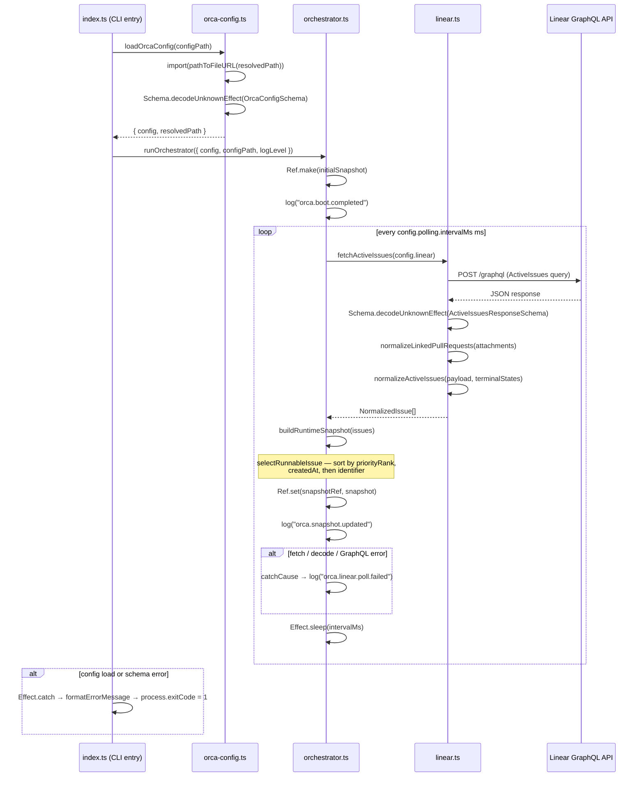

# Pull request review

Identifier: PET-46
Title: Orca bootstrap config and Linear discovery loop

## Original issue description

## What to build

Build the first end-to-end Orca tracer bullet: start from `orca.config.ts`, validate config with `Schema`, poll Linear for active issues, normalize linked PR refs, and maintain an in-memory orchestrator snapshot for a single runnable issue. Reference `SPEC-V2.md` sections 4, 5, 7, 8.1, 8.2, and 11.

## Acceptance criteria

- [ ] Starting Orca with a valid `orca.config.ts` boots successfully and invalid config fails fast with a schema-backed error.
- [ ] Orca polls Linear every 5 seconds, normalizes active issues including linked pull request refs, and selects at most one runnable issue at a time.
- [ ] A runtime snapshot and structured logs show the current normalized issue state, with tests covering config decode and Linear payload normalization.

## Existing pull request

- URL: https://github.com/peterje/orca2/pull/1
- Branch: orca/PET-46-orca-bootstrap-config-and-linear-discovery-loop-2

## Greptile review feedback

# Greptile review

Confidence: 3/5

## Unresolved review threads

<comment author="greptile-apps" path="apps/cli/src/domain.ts">
  <diffHunk><![CDATA[
@@ -0,0 +1,71 @@
+import { Schema } from "effect"
+
+const NormalizedStateSchema = Schema.Union([
+  Schema.Literal("runnable"),
+  Schema.Literal("linked-pr-detected"),
+  Schema.Literal("terminal"),
+])
+
+export const LinkedPullRequestRefSchema = Schema.Struct({
+  provider: Schema.Literal("github"),
+  owner: Schema.String,
+  repo: Schema.String,
+  number: Schema.Number,
+  url: Schema.String,
+  title: Schema.NullOr(Schema.String),
+  attachmentId: Schema.NullOr(Schema.String),
  ]]></diffHunk>
  <lineNumber>16</lineNumber>
  <body>**`attachmentId` is typed as nullable but is never `null` at runtime**

`Schema.NullOr(Schema.String)` allows `null` for `attachmentId`, but `normalizeLinkedPullRequests` in `linear.ts` always sets it to `attachment.id` — a `Schema.String` that is guaranteed non-null by the `AttachmentSchema`. The nullable type forces every downstream consumer to handle a `null` branch that can never actually occur, adding noise to call sites.

Since there is no current code path that produces a `null` `attachmentId`, tightening the schema would improve clarity:

```suggestion
  attachmentId: Schema.String,
```
</body>
</comment>
<comment author="greptile-apps" path="apps/cli/src/orca-config.ts">
  <diffHunk><![CDATA[
@@ -0,0 +1,78 @@
+import { Data, Effect, Schema } from "effect"
+import { pathToFileURL } from "node:url"
+import path from "node:path"
+
+export class ConfigLoadError extends Data.TaggedError("ConfigLoadError")<{
+  readonly path: string
+  readonly cause: unknown
+}> {}
+
+const requiredEnvVar = (name: string) =>
+  Schema.String.annotate({
+    message: `${name} environment variable must be set`,
+  })
  ]]></diffHunk>
  <lineNumber>13</lineNumber>
  <body>**`message` annotation should be a function, not a plain string**

In Effect Schema v4, the `message` annotation on `Annotations.Schema` is typed as `(issue: ParseIssue) => string` — a function, not a bare string literal. Passing a string directly compiles because `.annotate()` accepts a loosely-typed annotations record, but at runtime Effect Schema calls the annotation value as a function. If it is a string, the call throws `TypeError: annotation is not a function`, meaning the custom message is never rendered and the test at `orca-config.test.ts:88` that asserts the error contains `"LINEAR_API_KEY"` would fail.

The fix is to wrap the message in a thunk:

```suggestion
const requiredEnvVar = (name: string) =>
  Schema.String.annotate({
    message: () => `${name} environment variable must be set`,
  })
```
</body>
</comment>

## General comments

<comments>
  <comment author="greptile-apps">
    <body><h3>Greptile Summary</h3>

This PR implements the first end-to-end Orca tracer bullet: `orca.config.ts` schema validation via `Schema.decodeUnknownEffect`, a Linear GraphQL polling loop that normalizes active issues into `runnable` / `linked-pr-detected` / `terminal` states, GitHub PR URL extraction and deduplication from Linear attachments, and an in-memory `RuntimeSnapshot` maintained by the orchestrator. All critical issues from the previous review round have been addressed.

**Key observations:**
- `requiredEnvVar` in `orca-config.ts` annotates missing env var fields with `message: "..."` (a plain string) rather than `message: () => "..."` (the function form expected by Effect Schema). If Effect Schema calls the annotation as a function at runtime, this would throw a `TypeError` and silently suppress the named-variable message — and the `orca-config.test.ts` assertion that the error contains `"LINEAR_API_KEY"` would fail.
- `attachmentId` in `LinkedPullRequestRefSchema` is typed `NullOr(Schema.String)` but is always assigned a non-null `attachment.id` in `normalizeLinkedPullRequests`, unnecessarily widening the type for all downstream consumers.
- The PR description's verification steps list `bun run check` and `bun run build` but omit `bun test`, which is required by `AGENTS.md` ("test and typecheck before committing"). The three new test files cover critical normalization paths; confirming they pass before merge is recommended.

<h3>Confidence Score: 3/5</h3>

- Safe to merge after verifying `bun test` passes, particularly the `requiredEnvVar` message annotation behavior.
- The core logic (schema decode, polling loop, issue normalization, error handling) is solid and all previous critical issues have been resolved. The score is held at 3 rather than 4 because `bun test` is absent from the stated verification steps — the `requiredEnvVar` plain-string annotation may cause the `orca-config.test.ts` assertion to fail at runtime, which would be a functional regression in the user-facing error message for missing env vars. Once tests are confirmed green this could be raised to 4.
- Pay close attention to `apps/cli/src/orca-config.ts` (the `requiredEnvVar` message annotation) and `apps/cli/src/domain.ts` (`attachmentId` nullability).

<h3>Important Files Changed</h3>


| Filename | Overview |
|----------|----------|
| apps/cli/src/orchestrator.ts | Polling loop correctly uses `Effect.catchCause` for resilience; switched from `SubscriptionRef` to plain `Ref` (addressing prior feedback); `snapshotRef` is still local and never returned, meaning the `Ref` writes are currently unobservable from outside the function — acceptable for tracer-bullet scope. |
| apps/cli/src/linear.ts | Uses `Schema.decodeUnknownEffect` correctly; normalizes all three issue states (`runnable`, `linked-pr-detected`, `terminal`); deduplicates PR attachment URLs by owner/repo/number; `blockers: []` stub is annotated with a TODO. No new logic issues found. |
| apps/cli/src/orca-config.ts | Config decode correctly uses `Schema.decodeUnknownEffect`; `requiredEnvVar` attempts to annotate missing-env-var fields with a named message but passes a plain string instead of a function `(issue: ParseIssue) => string`, which may cause a runtime `TypeError` when the annotation is invoked during error rendering. |
| apps/cli/src/domain.ts | Clean domain schema definitions; all three `normalizedState` literals present; `attachmentId` on `LinkedPullRequestRefSchema` is typed `NullOr(String)` but is never assigned `null` in practice — minor type over-widening. |
| apps/cli/src/index.ts | CLI entry point correctly wires config loading, orchestrator, and error formatting; `FetchHttpClient.layer` and `BunServices.layer` are properly provided; `Effect.catch` handles all typed failures from both load and orchestration paths. |
| apps/cli/src/linear.test.ts | Good test coverage for normalization, deduplication, schema validation, terminal/runnable state classification, priority/age/identifier sort ordering, and the NaN-safe timestamp fallback path. |
| apps/cli/src/orca-config.test.ts | Tests valid decode, invalid-config schema failure (asserting `"LINEAR_API_KEY"` in the error message), and disk-load round-trip; correctness of the `LINEAR_API_KEY` assertion depends on whether the `requiredEnvVar` message annotation renders as expected at runtime. |

</details>


<h3>Sequence Diagram</h3>



<!-- greptile_other_comments_section -->

<sub>Last reviewed commit: 699c367</sub></body>
  </comment>
</comments>

## Repo instructions

# Information
- The base branch for this repository is `main`.
- The package manager used is `bun`.
- The runtime used is Bun

# Learning more about the "effect" & "@effect/\*" packages
`~/.reference/effect-v4` is an authoritative source of information about the
"effect" and "@effect/\*" packages. Read this before looking elsewhere for
information about these packages. It contains the best practices for using
effect. Use this for learning more about the library, rather than browsing the code in
`node_modules/`. Effect provides many utilities and composition patterns: Services and Layers, data strctures, Schema, and even CLI builders. Always search for and leverage Effect-native solutions where possible. Never rewrite your own code that can be modeled with Effect, eg parsing / validation / concurrency.

## Code Style
- use kebab-case for all file names.

# Testing
Test everything with `bun test`

# Git Workflow
- test and typecheck before committing.
- commit directly to main
- always use conventional commits.
- prefer lowercase.
   - "cli", not "CLI"
   - "github", not "GitHub"
   - "http", not "HTTP"
- write commits and descriptions in imperative mood
- all pr commits will be squashed: ensure pr titles follow the same rules as commits
</git>


## Orca execution constraints

- Work only in the current worktree on branch `orca/PET-46-orca-bootstrap-config-and-linear-discovery-loop-2`.
- Base branch is `main`.
- Address the requested Greptile feedback and keep the existing pull request moving.
- Do not ask for permission; pick reasonable defaults and keep going.
- Do not mutate unrelated git state.
- Do not commit secrets or any files under `.orca/`.
- Use a conventional commit message if you create a commit.
- Keep using the existing branch and pull request.

## Verification commands

- `bun run check`
- `bun run build`

## Required git outcome

- Have the existing branch ready for another Greptile review pass.
- Use a conventional commit message every time you create a commit.
- Update the existing pull request instead of creating a new branch or pull request.
- Keep the pull request title unchanged.
- If you update the PR description, keep the same lowercase narrative format with `**closes**`, `**summary**`, and `**verification**`.
- Mention the verification commands you ran in any pull request update you make.
