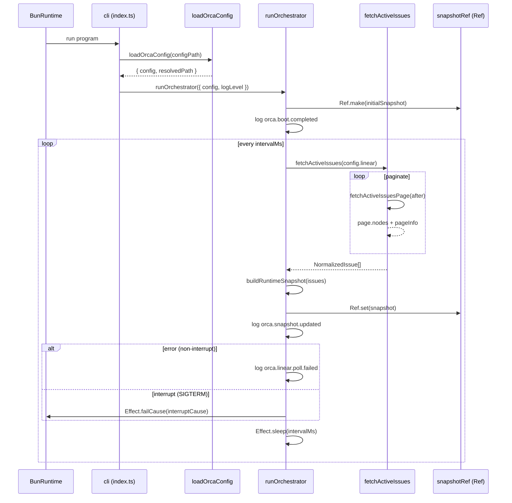

# Pull request review

Identifier: PET-46
Title: Orca bootstrap config and Linear discovery loop

## Original issue description

## What to build

Build the first end-to-end Orca tracer bullet: start from `orca.config.ts`, validate config with `Schema`, poll Linear for active issues, normalize linked PR refs, and maintain an in-memory orchestrator snapshot for a single runnable issue. Reference `SPEC-V2.md` sections 4, 5, 7, 8.1, 8.2, and 11.

## Acceptance criteria

- [ ] Starting Orca with a valid `orca.config.ts` boots successfully and invalid config fails fast with a schema-backed error.
- [ ] Orca polls Linear every 5 seconds, normalizes active issues including linked pull request refs, and selects at most one runnable issue at a time.
- [ ] A runtime snapshot and structured logs show the current normalized issue state, with tests covering config decode and Linear payload normalization.

## Existing pull request

- URL: https://github.com/peterje/orca2/pull/1
- Branch: orca/PET-46-orca-bootstrap-config-and-linear-discovery-loop-2

## Greptile review feedback

# Greptile review

Confidence: 4/5

## Unresolved review threads

<comment author="greptile-apps" path="apps/cli/src/index.ts">
  <diffHunk><![CDATA[
@@ -1,11 +1,49 @@
 import { BunServices } from "@effect/platform-bun"
-import { Console, Effect } from "effect"
-import { Command } from "effect/unstable/cli"
+import { Effect, Layer } from "effect"
+import { FetchHttpClient } from "effect/unstable/http"
+import { Command, Flag } from "effect/unstable/cli"
+import { formatErrorMessage } from "./error-format"
+import { writeLogLine } from "./logging"
+import { runOrchestrator } from "./orchestrator"
+import { appLogLevels } from "./logging"
  ]]></diffHunk>
  <lineNumber>8</lineNumber>
  <body>**Duplicate imports from the same module**

`writeLogLine` and `appLogLevels` are both imported from `"./logging"` in two separate import statements. These should be merged into a single import to follow standard module hygiene.

```suggestion
import { appLogLevels, writeLogLine } from "./logging"
```


<sub>Note: If this suggestion doesn't match your team's coding style, reply to this and let me know. I'll remember it for next time!</sub></body>
</comment>
<comment author="greptile-apps" path="apps/cli/src/domain.ts">
  <diffHunk><![CDATA[
@@ -0,0 +1,71 @@
+import { Schema } from "effect"
+
+const NormalizedStateSchema = Schema.Union([
+  Schema.Literal("runnable"),
+  Schema.Literal("linked-pr-detected"),
+  Schema.Literal("terminal"),
+])
+
+export const LinkedPullRequestRefSchema = Schema.Struct({
+  provider: Schema.Literal("github"),
+  owner: Schema.String,
+  repo: Schema.String,
+  number: Schema.Number,
+  url: Schema.String,
+  title: Schema.NullOr(Schema.String),
+  attachmentId: Schema.String,
+})
+
+export type LinkedPullRequestRef = Schema.Schema.Type<
+  typeof LinkedPullRequestRefSchema
+>
+
+export const BlockerRefSchema = Schema.Struct({
+  id: Schema.String,
+  identifier: Schema.String,
+  title: Schema.String,
+  stateName: Schema.String,
+  terminal: Schema.Boolean,
+})
+
+export type BlockerRef = Schema.Schema.Type<typeof BlockerRefSchema>
+
+export const NormalizedIssueSchema = Schema.Struct({
+  id: Schema.String,
+  identifier: Schema.String,
+  title: Schema.String,
+  description: Schema.NullOr(Schema.String),
+  branchName: Schema.NullOr(Schema.String),
+  priority: Schema.Number,
+  priorityRank: Schema.Number,
+  createdAt: Schema.String,
+  updatedAt: Schema.String,
+  stateName: Schema.String,
+  stateType: Schema.NullOr(Schema.String),
+  labels: Schema.Array(Schema.String),
+  linkedPullRequests: Schema.Array(LinkedPullRequestRefSchema),
+  blockers: Schema.Array(BlockerRefSchema),
+  normalizedState: NormalizedStateSchema,
+  runnable: Schema.Boolean,
  ]]></diffHunk>
  <lineNumber>49</lineNumber>
  <body>**`runnable` is always derivable from `normalizedState`**

`NormalizedIssueSchema` carries both `runnable: boolean` and `normalizedState`, where `runnable` is always equivalent to `normalizedState === "runnable"`. Having both fields means every code path that constructs a `NormalizedIssue` (and any future ones) must keep them in sync manually. For example, `orchestrator.ts` uses `issue.runnable` for filtering while the same information is available via `normalizedState`.

Consider removing `runnable` from the schema and deriving it at call sites:

```ts
// in orchestrator.ts
.filter((issue) => issue.normalizedState === "runnable")
```

This eliminates the redundant field and prevents any future divergence between the two values.
</body>
</comment>
<comment author="greptile-apps" path="apps/cli/src/orchestrator.ts">
  <diffHunk><![CDATA[
@@ -0,0 +1,105 @@
+import { Cause, Duration, Effect, Ref } from "effect"
+import type { RuntimeSnapshot, SelectedRunnableIssue } from "./domain"
+import { formatErrorMessage } from "./error-format"
+import { fetchActiveIssues } from "./linear"
+import type { AppLogLevel } from "./logging"
+import { log } from "./logging"
+import type { OrcaConfig } from "./orca-config"
+
+const compareIssues = (
+  left: RuntimeSnapshot["activeIssues"][number],
+  right: RuntimeSnapshot["activeIssues"][number],
+) => {
+  const priorityDifference = left.priorityRank - right.priorityRank
+  if (priorityDifference !== 0) {
+    return priorityDifference
+  }
+
+  const leftCreatedAtTime = new Date(left.createdAt).getTime()
+  const rightCreatedAtTime = new Date(right.createdAt).getTime()
+  const createdAtDifference =
+    Number.isFinite(leftCreatedAtTime) && Number.isFinite(rightCreatedAtTime)
+      ? leftCreatedAtTime - rightCreatedAtTime
+      : 0
+  if (createdAtDifference !== 0) {
+    return createdAtDifference
+  }
+
+  return left.identifier.localeCompare(right.identifier)
+}
+
+export const selectRunnableIssue = (
+  issues: RuntimeSnapshot["activeIssues"],
+): SelectedRunnableIssue | null => {
+  const runnableIssues = issues
+    .filter((issue) => issue.runnable)
+    .sort(compareIssues)
+  const selectedIssue = runnableIssues[0]
+
+  if (!selectedIssue) {
+    return null
+  }
+
+  return {
+    id: selectedIssue.id,
+    identifier: selectedIssue.identifier,
+    title: selectedIssue.title,
+    normalizedState: "runnable",
+  }
+}
+
+export const buildRuntimeSnapshot = (
+  issues: RuntimeSnapshot["activeIssues"],
+): RuntimeSnapshot => ({
+  updatedAt: new Date().toISOString(),
+  activeIssues: [...issues].sort(compareIssues),
+  runnableIssue: selectRunnableIssue(issues),
+})
+
+const logSnapshot = (minimumLogLevel: AppLogLevel, snapshot: RuntimeSnapshot) =>
+  log(minimumLogLevel, "Info", "orca.snapshot.updated", {
+    active_issue_count: snapshot.activeIssues.length,
+    runnable_issue_identifier: snapshot.runnableIssue?.identifier ?? null,
+    snapshot,
+  })
+
+export const runOrchestrator = ({
+  config,
+  configPath,
+  logLevel,
+}: {
+  readonly config: OrcaConfig
+  readonly configPath: string
+  readonly logLevel: AppLogLevel
+}) =>
+  Effect.gen(function* () {
+    const snapshotRef = yield* Ref.make<RuntimeSnapshot>({
+      updatedAt: new Date(0).toISOString(),
+      activeIssues: [],
+      runnableIssue: null,
+    })
+
+    yield* log(logLevel, "Info", "orca.boot.completed", {
+      config_path: configPath,
+      polling_interval_ms: config.polling.intervalMs,
+      linear_project_slug: config.linear.projectSlug,
+    })
+
+    const pollOnce = fetchActiveIssues(config.linear).pipe(
+      Effect.map(buildRuntimeSnapshot),
+      Effect.tap((snapshot) => Ref.set(snapshotRef, snapshot)),
+      Effect.tap((snapshot) => logSnapshot(logLevel, snapshot)),
+      Effect.catchCause((cause: Cause.Cause<unknown>) =>
+        Cause.hasInterrupts(cause)
+          ? Effect.failCause(cause)
+          : log(logLevel, "Error", "orca.linear.poll.failed", {
+              message: formatErrorMessage(Cause.squash(cause)),
+            }),
+      ),
+    )
+
+    while (true) {
+      yield* pollOnce
+      yield* Effect.sleep(Duration.millis(config.polling.intervalMs))
+    }
  ]]></diffHunk>
  <lineNumber>104</lineNumber>
  <body>**Poll interval measures elapsed-time-between-completions, not between starts**

The current loop sleeps *after* the poll completes:
```
poll (takes T ms) → sleep(intervalMs) → poll → ...
```
This means the actual time between poll *starts* is `intervalMs + T` (poll duration). For the 5 s default interval, a slow Linear API call (e.g. 2 s) would produce a 7 s effective period. If Orca ever needs tighter cadence guarantees, the sleep should be scheduled relative to the wall-clock time the poll *started* (e.g. using `Effect.race` with a timeout, or computing the remaining sleep time). For the current bootstrap scope this is low-risk, but worth documenting with a comment so future maintainers understand the semantics.
</body>
</comment>

## General comments

<comments>
  <comment author="greptile-apps">
    <body><h3>Greptile Summary</h3>

This PR implements the Orca bootstrap: config validation via Effect Schema, a paginated Linear polling loop, GitHub PR attachment normalization, and an in-memory orchestrator snapshot — closing PET-46. The implementation addresses the majority of issues raised in the previous review cycle (switching to `Schema.decodeUnknownEffect`, adding the `"terminal"` state variant, fixing the `...fields` spread order in logging, implementing full pagination, re-raising fiber interrupts on SIGTERM, and replacing `SubscriptionRef` with `Ref`).

Key observations:
- The `message` annotation on `requiredEnvVar` in `orca-config.ts` is still a plain string literal; Effect Schema v4 expects this to be a `(issue: ParseIssue) => string` function. If the runtime calls it as a function, a `TypeError` would be thrown and the custom env-var name would never appear in the error output.
- `NormalizedIssueSchema` carries both `runnable: boolean` and `normalizedState`, where `runnable` is always `normalizedState === "runnable"` — removing the redundant field would eliminate a future inconsistency surface.
- `index.ts` has two separate `import` statements from `"./logging"` that should be merged.
- The polling loop sleeps *after* each poll completes, so the effective cadence is `intervalMs + poll duration`; this is reasonable for the current scope but worth documenting.
- The `blockers` field is correctly stubbed with a `// TODO` comment, and `snapshotRef` is intentionally internal for this tracer-bullet iteration.


<h3>Confidence Score: 4/5</h3>

- Safe to merge with minor follow-ups; core logic is sound and the majority of prior review concerns have been addressed.
- The iteration resolves almost all previously flagged issues — correct Effect error channels, full pagination, graceful interrupt handling, structured startup logging, and the `cancelled` terminal type. The remaining open items are: (1) the `requiredEnvVar` message annotation is still a plain string, which could silently suppress the custom env-var hint at runtime; (2) the redundant `runnable` field in the domain schema; (3) a minor duplicate import in `index.ts`. None of these block correctness for the bootstrap scope.
- apps/cli/src/orca-config.ts (message annotation type), apps/cli/src/domain.ts (redundant runnable field)

<h3>Important Files Changed</h3>


| Filename | Overview |
|----------|----------|
| apps/cli/src/linear.ts | Core Linear API integration: adds `decodeActiveIssuesResponse` (now correctly using `Schema.decodeUnknownEffect`), full pagination loop, GitHub PR attachment normalization with null-title deduplication, and `cancelled` state-type terminal detection. Previously flagged issues around sync schema decoding, missing `cancelled` guard, and deduplication `attachmentId` mismatch are all addressed. |
| apps/cli/src/orchestrator.ts | Polling loop and snapshot management: uses `Ref.make` (replacing `SubscriptionRef`), re-raises fiber interrupt causes via `Cause.hasInterrupts`, and correctly guards `NaN` timestamps in `compareIssues`. The sleep-after-poll pattern means effective polling cadence is `intervalMs + poll duration`, which is worth documenting. |
| apps/cli/src/orca-config.ts | Config schema and loader: `decodeOrcaConfig` now uses `Schema.decodeUnknownEffect`, eliminating the previous defect risk. The `requiredEnvVar` helper annotates missing env var errors with the variable name; the `message` annotation is still a plain string (Effect Schema v4 expects a function), which is an outstanding concern from the prior review cycle. |
| apps/cli/src/domain.ts | Domain schema definitions: `NormalizedStateSchema` now correctly includes the `"terminal"` literal, and `attachmentId` was tightened to non-nullable `Schema.String`. Both `runnable: boolean` and `normalizedState` are present — the former is fully derivable from the latter, creating a small redundancy maintenance surface. |
| apps/cli/src/index.ts | CLI entry point: startup errors now route through `writeLogLine` producing structured NDJSON (resolving the prior mixed-format concern). Two separate imports from `"./logging"` should be merged into one. |
| apps/cli/src/logging.ts | Structured logging utilities: `...fields` spread now comes before reserved keys (`timestamp`, `level`, `event`) so reserved keys always win, resolving the prior silent-overwrite concern. `shouldLog` logic is correct. |
| orca.config.ts | Bootstrap Orca config: `requiredScore` is correctly set to `4` (down from `5`), resolving the self-gating concern. Env vars are sourced from `process.env.*` and validated via the schema's `requiredEnvVar` annotation. |
| apps/cli/src/linear.test.ts | Comprehensive test coverage for normalization: covers deduplication with null-title promotion (asserting `attachmentId: "attachment-11"` correctly), terminal state detection via both `terminalStates` list and `state.type`, priority/age/identifier sort ordering, and invalid timestamp fallback. |
| apps/cli/src/orca-config.test.ts | Config decode and file-load tests: validates happy path, schema failure with env-var name in message, and dynamic TypeScript file loading. Tests cover the key acceptance criteria for config validation. |
| apps/cli/src/error-format.ts | Error formatting helper: handles `Schema.isSchemaError`, `ConfigLoadError`, generic `Error`, and string fallback. No issues found. |

</details>


<h3>Sequence Diagram</h3>



<!-- greptile_other_comments_section -->

<sub>Last reviewed commit: 6bbabe1</sub></body>
  </comment>
</comments>

## Repo instructions

# Information
- The base branch for this repository is `main`.
- The package manager used is `bun`.
- The runtime used is Bun

# Learning more about the "effect" & "@effect/\*" packages
`~/.reference/effect-v4` is an authoritative source of information about the
"effect" and "@effect/\*" packages. Read this before looking elsewhere for
information about these packages. It contains the best practices for using
effect. Use this for learning more about the library, rather than browsing the code in
`node_modules/`. Effect provides many utilities and composition patterns: Services and Layers, data strctures, Schema, and even CLI builders. Always search for and leverage Effect-native solutions where possible. Never rewrite your own code that can be modeled with Effect, eg parsing / validation / concurrency.

## Code Style
- use kebab-case for all file names.

# Testing
Test everything with `bun test`

# Git Workflow
- test and typecheck before committing.
- commit directly to main
- always use conventional commits.
- prefer lowercase.
   - "cli", not "CLI"
   - "github", not "GitHub"
   - "http", not "HTTP"
- write commits and descriptions in imperative mood
- all pr commits will be squashed: ensure pr titles follow the same rules as commits
</git>


## Orca execution constraints

- Work only in the current worktree on branch `orca/PET-46-orca-bootstrap-config-and-linear-discovery-loop-2`.
- Base branch is `main`.
- Address the requested Greptile feedback and keep the existing pull request moving.
- Do not ask for permission; pick reasonable defaults and keep going.
- Do not mutate unrelated git state.
- Do not commit secrets or any files under `.orca/`.
- Use a conventional commit message if you create a commit.
- Keep using the existing branch and pull request.

## Verification commands

- `bun run check`
- `bun run build`

## Required git outcome

- Have the existing branch ready for another Greptile review pass.
- Use a conventional commit message every time you create a commit.
- Update the existing pull request instead of creating a new branch or pull request.
- Keep the pull request title unchanged.
- If you update the PR description, keep the same lowercase narrative format with `**closes**`, `**summary**`, and `**verification**`.
- Mention the verification commands you ran in any pull request update you make.
