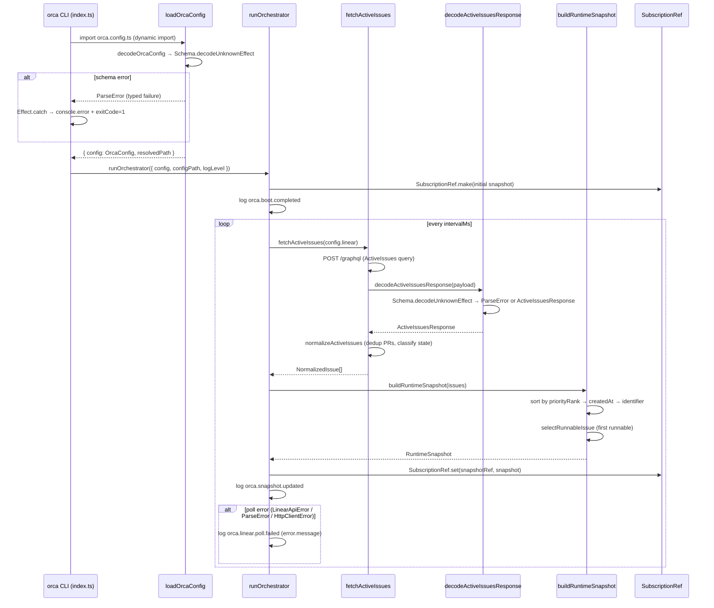

# Pull request review

Identifier: PET-46
Title: Orca bootstrap config and Linear discovery loop

## Original issue description

## What to build

Build the first end-to-end Orca tracer bullet: start from `orca.config.ts`, validate config with `Schema`, poll Linear for active issues, normalize linked PR refs, and maintain an in-memory orchestrator snapshot for a single runnable issue. Reference `SPEC-V2.md` sections 4, 5, 7, 8.1, 8.2, and 11.

## Acceptance criteria

- [ ] Starting Orca with a valid `orca.config.ts` boots successfully and invalid config fails fast with a schema-backed error.
- [ ] Orca polls Linear every 5 seconds, normalizes active issues including linked pull request refs, and selects at most one runnable issue at a time.
- [ ] A runtime snapshot and structured logs show the current normalized issue state, with tests covering config decode and Linear payload normalization.

## Existing pull request

- URL: https://github.com/peterje/orca2/pull/1
- Branch: orca/PET-46-orca-bootstrap-config-and-linear-discovery-loop-2

## Greptile review feedback

# Greptile review

Confidence: 3/5

## Unresolved review threads

<comment author="greptile-apps" path="orca.config.ts">
  <diffHunk><![CDATA[
@@ -0,0 +1,43 @@
+export default {
+  linear: {
+    apiKey: process.env.LINEAR_API_KEY,
+    endpoint: "https://api.linear.app/graphql",
+    projectSlug: "orca",
  ]]></diffHunk>
  <lineNumber>5</lineNumber>
  <body>**Missing env vars produce an opaque schema error without naming the variable**

Both `apiKey` values come from `process.env.*` and are therefore `string | undefined`. When an env var is not set, `decodeOrcaConfig` fails with `"Expected string, got undefined"` — which is correct fast-fail behaviour, but gives the operator no indication of *which* env var needs to be set.

Consider guarding before the value reaches the schema, so the thrown error names the expected variable. Alternatively, use a `Schema.filter` on the field that annotates the error with a descriptive message. Either approach ensures the operator sees a concrete action to take rather than a bare schema parse-tree message.</body>
</comment>

## General comments

<comments>
  <comment author="greptile-apps">
    <body><h3>Greptile Summary</h3>

This PR implements the first end-to-end Orca tracer bullet: it boots from `orca.config.ts`, validates config with Effect Schema, polls Linear every 5 seconds for active issues, normalizes linked GitHub PR attachments with deduplication, selects at most one runnable issue by priority/age/identifier, and maintains a `SubscriptionRef`-backed in-memory snapshot — addressing all three acceptance criteria from PET-46.

**Key changes:**
- `orca-config.ts` — Effect Schema config loader using `Schema.decodeUnknownEffect` for typed fast-fail on invalid config
- `linear.ts` — GraphQL client, PR URL regex normalization, and `normalizeActiveIssues` mapping raw issues to `NormalizedIssue`; previous issues with `Effect.sync`/`Schema.decodeUnknownSync` defects have been resolved
- `orchestrator.ts` — `while(true)` poll loop with `SubscriptionRef` snapshot, structured JSON logging, and per-poll error recovery
- `domain.ts` — Shared Effect Schema types including `NormalizedIssue`, `RuntimeSnapshot`, and `BlockerRef`; `"terminal"` state variant is now correctly present
- `index.ts` — CLI flags (`--config`, `--log-level`) wired to the orchestrator, with a top-level error formatter
- `linear.test.ts` / `orca-config.test.ts` — Good coverage of normalization, deduplication, schema validation, and snapshot selection

**Issues found:**
- `ConfigLoadError` (thrown when `orca.config.ts` cannot be found or imported) has its `path` and `cause` fields silently dropped by the top-level error handler in `index.ts`, which only reads `.message` — users see `"ConfigLoadError"` instead of the OS error
- The poll-loop catch block in `orchestrator.ts` uses `error.message` for all errors, losing structured schema parse information when `decodeActiveIssuesResponse` fails
- Missing env vars in `orca.config.ts` produce a bare `"Expected string, got undefined"` schema error without identifying which env var to set

<h3>Confidence Score: 3/5</h3>

- Mostly safe to merge — the core Effect/Schema defect issue from the previous review has been fixed, but a `ConfigLoadError` swallowing bug and minor error-message quality issues remain.
- The two critical `Effect.sync`/`Schema.decodeUnknownSync` defect bugs from the previous review are resolved, and the `"terminal"` state variant is now correctly present. However, a new logic issue was found: the top-level `Effect.catch` in `index.ts` extracts only `error.message` from `ConfigLoadError`, which is set to the tag name `"ConfigLoadError"` by `Data.TaggedError` — the `path` and `cause` fields (containing the real OS error) are never shown to the user. This means the "invalid config fails fast with a schema-backed error" acceptance criterion partially holds for schema failures but silently drops the human-readable message for file-not-found failures. The remaining concerns (opaque schema error in the poll-loop catch, unnamed env vars in `orca.config.ts`) are UX-level and non-blocking.
- `apps/cli/src/index.ts` — top-level `ConfigLoadError` handler drops the helpful `cause` and `path` fields

<h3>Important Files Changed</h3>


| Filename | Overview |
|----------|----------|
| apps/cli/src/index.ts | CLI entrypoint with flag definitions and a top-level error handler; the handler silently drops `ConfigLoadError`'s `path`/`cause` details, showing only the tag name to the user. |
| apps/cli/src/linear.ts | GraphQL client, PR URL normalization, and issue normalization; `decodeActiveIssuesResponse` now correctly uses `Schema.decodeUnknownEffect` for typed failures; `blockers` is a known stub always set to `[]`. |
| apps/cli/src/orca-config.ts | Config schema and loader using `Schema.decodeUnknownEffect` (typed failures); `ConfigLoadError` is surfaced as a typed error but its human-readable `cause` is not exposed by the top-level handler. |
| apps/cli/src/orchestrator.ts | Poll loop with `SubscriptionRef` snapshot and structured JSON logging; catch block in `pollOnce` logs `error.message` which loses structured schema error info — minor UX issue. |
| apps/cli/src/domain.ts | Effect Schema domain types including `NormalizedIssue`, `RuntimeSnapshot`, and `BlockerRef`; `"terminal"` state variant is now present in `NormalizedStateSchema`; `BlockerRefSchema` is defined but intentionally not populated yet. |

</details>


<h3>Sequence Diagram</h3>



<!-- greptile_failed_comments -->
<details><summary><h3>Comments Outside Diff (2)</h3></summary>

1. `apps/cli/src/index.ts`, line 314-325 ([link](https://github.com/peterje/orca2/blob/2e912e636924618ed0e11e00010c59a8a5cfd9a8/apps/cli/src/index.ts#L314-L325)) 

   **`ConfigLoadError` details are silently dropped by the error handler**

   When `loadOrcaConfig` cannot find or parse the config file, it yields a `ConfigLoadError` with `path` and `cause` fields. When that error reaches this handler, `error instanceof Error` is `true` (because `Data.TaggedError` extends `Error`), so only `error.message` is shown — but `Data.TaggedError` sets `.message` to the tag string `"ConfigLoadError"`, not to a human-readable description. The OS error (e.g. `ENOENT: no such file or directory`) is stored in `cause`, which is never accessed here.

   The user ends up seeing `"ConfigLoadError"` on stderr with no indication of which file failed or why.

   Add a branch that checks for `ConfigLoadError` specifically:

   ```ts
   import { ConfigLoadError } from "./orca-config"

   Effect.catch((error: unknown) =>
     Effect.sync(() => {
       let message: string
       if (Schema.isSchemaError(error)) {
         message = String(error.issue)
       } else if (error instanceof ConfigLoadError) {
         message = `failed to load config from ${error.path}: ${error.cause instanceof Error ? error.cause.message : String(error.cause)}`
       } else if (error instanceof Error) {
         message = error.message
       } else {
         message = String(error)
       }

       console.error(message)
       process.exitCode = 1
     }),
   ),
   ```


2. `apps/cli/src/orchestrator.ts`, line 1205-1209 ([link](https://github.com/peterje/orca2/blob/2e912e636924618ed0e11e00010c59a8a5cfd9a8/apps/cli/src/orchestrator.ts#L1205-L1209)) 

   **Schema errors logged as opaque tag strings in the poll error handler**

   When `decodeActiveIssuesResponse` produces a `ParseError` (a typed Effect failure), it reaches this catch block. Because `ParseError` extends `Error`, the branch `error instanceof Error ? error.message : String(error)` fires — but `ParseError.message` is often the tag name rather than the human-readable parse tree. The structured parse information is available via `String(error.issue)`.

</details>

<!-- /greptile_failed_comments -->

<sub>Last reviewed commit: 2e912e6</sub></body>
  </comment>
</comments>

## Repo instructions

# Information
- The base branch for this repository is `main`.
- The package manager used is `bun`.
- The runtime used is Bun

# Learning more about the "effect" & "@effect/\*" packages
`~/.reference/effect-v4` is an authoritative source of information about the
"effect" and "@effect/\*" packages. Read this before looking elsewhere for
information about these packages. It contains the best practices for using
effect. Use this for learning more about the library, rather than browsing the code in
`node_modules/`. Effect provides many utilities and composition patterns: Services and Layers, data strctures, Schema, and even CLI builders. Always search for and leverage Effect-native solutions where possible. Never rewrite your own code that can be modeled with Effect, eg parsing / validation / concurrency.

## Code Style
- use kebab-case for all file names.

# Testing
Test everything with `bun test`

# Git Workflow
- test and typecheck before committing.
- commit directly to main
- always use conventional commits.
- prefer lowercase.
   - "cli", not "CLI"
   - "github", not "GitHub"
   - "http", not "HTTP"
- write commits and descriptions in imperative mood
- all pr commits will be squashed: ensure pr titles follow the same rules as commits
</git>


## Orca execution constraints

- Work only in the current worktree on branch `orca/PET-46-orca-bootstrap-config-and-linear-discovery-loop-2`.
- Base branch is `main`.
- Address the requested Greptile feedback and keep the existing pull request moving.
- Do not ask for permission; pick reasonable defaults and keep going.
- Do not mutate unrelated git state.
- Do not commit secrets or any files under `.orca/`.
- Use a conventional commit message if you create a commit.
- Keep using the existing branch and pull request.

## Verification commands

- `bun run check`
- `bun run build`

## Required git outcome

- Have the existing branch ready for another Greptile review pass.
- Use a conventional commit message every time you create a commit.
- Update the existing pull request instead of creating a new branch or pull request.
- Keep the pull request title unchanged.
- If you update the PR description, keep the same lowercase narrative format with `**closes**`, `**summary**`, and `**verification**`.
- Mention the verification commands you ran in any pull request update you make.
