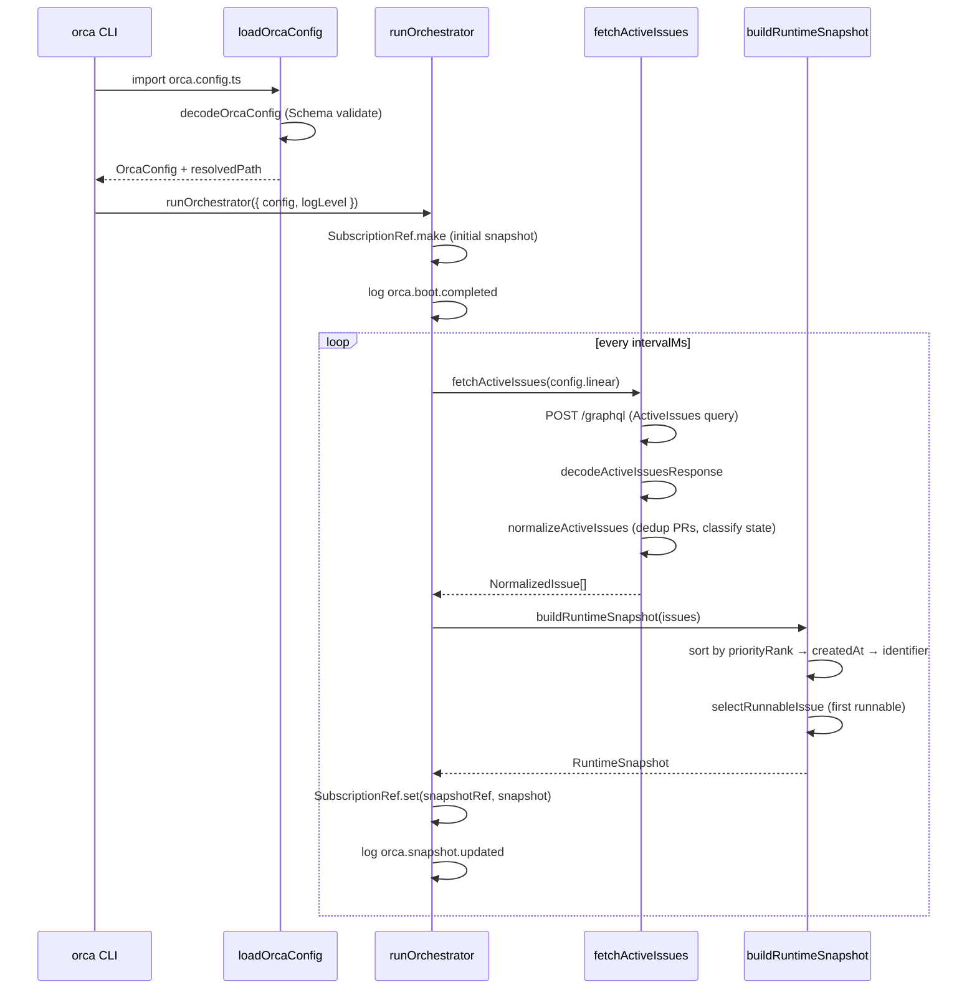

# Pull request review

Identifier: PET-46
Title: Orca bootstrap config and Linear discovery loop

## Original issue description

## What to build

Build the first end-to-end Orca tracer bullet: start from `orca.config.ts`, validate config with `Schema`, poll Linear for active issues, normalize linked PR refs, and maintain an in-memory orchestrator snapshot for a single runnable issue. Reference `SPEC-V2.md` sections 4, 5, 7, 8.1, 8.2, and 11.

## Acceptance criteria

- [ ] Starting Orca with a valid `orca.config.ts` boots successfully and invalid config fails fast with a schema-backed error.
- [ ] Orca polls Linear every 5 seconds, normalizes active issues including linked pull request refs, and selects at most one runnable issue at a time.
- [ ] A runtime snapshot and structured logs show the current normalized issue state, with tests covering config decode and Linear payload normalization.

## Existing pull request

- URL: https://github.com/peterje/orca2/pull/1
- Branch: orca/PET-46-orca-bootstrap-config-and-linear-discovery-loop-2

## Greptile review feedback

# Greptile review

Confidence: 2/5

## General comments

<comments>
  <comment author="greptile-apps">
    <body><h3>Greptile Summary</h3>

This PR implements the first end-to-end tracer bullet for Orca: it boots from `orca.config.ts`, validates the config with Effect Schema, polls Linear every 5 seconds for active issues, normalizes linked GitHub PR attachments with deduplication, selects at most one runnable issue by priority/age/identifier, and maintains a `SubscriptionRef`-backed in-memory snapshot — laying the foundation for the subsequent automation tiers (PET-47 through PET-51).

**Key changes:**
- `orca-config.ts` — Effect Schema-validated config loader with fast-fail on missing/invalid fields
- `linear.ts` — GraphQL client, PR URL regex normalization, and `normalizeActiveIssues` mapping raw issues to `NormalizedIssue`
- `orchestrator.ts` — `while(true)` poll loop with `SubscriptionRef` snapshot and structured JSON logging
- `domain.ts` — Shared Effect Schema types (`NormalizedIssue`, `RuntimeSnapshot`, `BlockerRef`, etc.)
- `index.ts` — CLI flags (`--config`, `--log-level`) wired to the orchestrator, with a top-level error formatter

**Issues found:**
- `decodeOrcaConfig` (in `orca-config.ts`) and `decodeActiveIssuesResponse` (in `linear.ts`) both use `Effect.sync` to wrap `Schema.decodeUnknownSync`. Because `Effect.sync` treats thrown exceptions as **defects** (not typed failures), schema parse errors bypass `Effect.catch` entirely — meaning the user-friendly error formatting in `index.ts` is never invoked for config or Linear response validation failures.
- `normalizedState` collapses terminal issues with no linked PRs into `"linked-pr-detected"`, which is semantically incorrect if issues ever escape the `activeStates` filter.
- `blockers` is always `[]`; the field and schema are defined but the GraphQL query never fetches relations, which could cause confusion downstream.

<h3>Confidence Score: 2/5</h3>

- Not safe to merge as-is — schema validation errors become silent defects that bypass the error handler, breaking the core "fail fast with a schema-backed error" acceptance criterion.
- The `Effect.sync`/`Schema.decodeUnknownSync` pattern in both `orca-config.ts` and `linear.ts` directly undermines the stated acceptance criterion ("invalid config fails fast with a schema-backed error"). Because defects bypass `Effect.catch`, a bad `orca.config.ts` will crash with a raw stack trace instead of the formatted message, and `process.exitCode` won't be set to 1. The fix is a one-line change per function (`Schema.decodeUnknown` instead of `Effect.sync(...decodeUnknownSync...)`), but it needs to land before the remaining acceptance criteria can be trusted.
- `apps/cli/src/orca-config.ts` and `apps/cli/src/linear.ts` — both use `Effect.sync` wrapping throwing schema decode calls.

<h3>Important Files Changed</h3>

| Filename | Overview |
|----------|----------|
| apps/cli/src/orca-config.ts | Defines OrcaConfig schema and loader; `decodeOrcaConfig` uses `Effect.sync` wrapping `Schema.decodeUnknownSync`, making parse errors into defects that bypass `Effect.catch` in the entrypoint. |
| apps/cli/src/linear.ts | Linear GraphQL client and normalization logic; `decodeActiveIssuesResponse` has the same `Effect.sync`/defect bug, and `blockers` is always an empty array despite the schema declaring the field. `normalizedState` collapses terminal issues into `"linked-pr-detected"` incorrectly. |
| apps/cli/src/orchestrator.ts | Polling loop and snapshot builder; straightforward and correct. `snapshotRef` is created/updated but never subscribed to — appears to be a placeholder for future consumers. |
| apps/cli/src/index.ts | CLI entrypoint with flag definitions and global error handler; the `Schema.isSchemaError` guard is intended to pretty-print parse errors, but schema errors from config/linear decoding are defects (not typed failures) so this handler will never fire for them. |
| apps/cli/src/domain.ts | Effect Schema definitions for domain types; well-structured. `BlockerRefSchema` is defined but never populated at runtime. |

<h3>Sequence Diagram</h3>

<!-- greptile_other_comments_section -->

Last reviewed commit: 0619156</body>
  </comment>
</comments>

## Repo instructions

# Information
- The base branch for this repository is `main`.
- The package manager used is `bun`.
- The runtime used is Bun

# Learning more about the "effect" & "@effect/\*" packages
`~/.reference/effect-v4` is an authoritative source of information about the
"effect" and "@effect/\*" packages. Read this before looking elsewhere for
information about these packages. It contains the best practices for using
effect. Use this for learning more about the library, rather than browsing the code in
`node_modules/`. Effect provides many utilities and composition patterns: Services and Layers, data strctures, Schema, and even CLI builders. Always search for and leverage Effect-native solutions where possible. Never rewrite your own code that can be modeled with Effect, eg parsing / validation / concurrency.

## Code Style
- use kebab-case for all file names.

# Testing
Test everything with `bun test`

# Git Workflow
- test and typecheck before committing.
- commit directly to main
- always use conventional commits.
- prefer lowercase.
   - "cli", not "CLI"
   - "github", not "GitHub"
   - "http", not "HTTP"
- write commits and descriptions in imperative mood
- all pr commits will be squashed: ensure pr titles follow the same rules as commits
</git>

## Orca execution constraints

- Work only in the current worktree on branch `orca/PET-46-orca-bootstrap-config-and-linear-discovery-loop-2`.
- Base branch is `main`.
- Address the requested Greptile feedback and keep the existing pull request moving.
- Do not ask for permission; pick reasonable defaults and keep going.
- Do not mutate unrelated git state.
- Do not commit secrets or any files under `.orca/`.
- Use a conventional commit message if you create a commit.
- Keep using the existing branch and pull request.

## Verification commands

- `bun run check`
- `bun run build`

## Required git outcome

- Have the existing branch ready for another Greptile review pass.
- Use a conventional commit message every time you create a commit.
- Update the existing pull request instead of creating a new branch or pull request.
- Keep the pull request title unchanged.
- If you update the PR description, keep the same lowercase narrative format with `**closes**`, `**summary**`, and `**verification**`.
- Mention the verification commands you ran in any pull request update you make.
